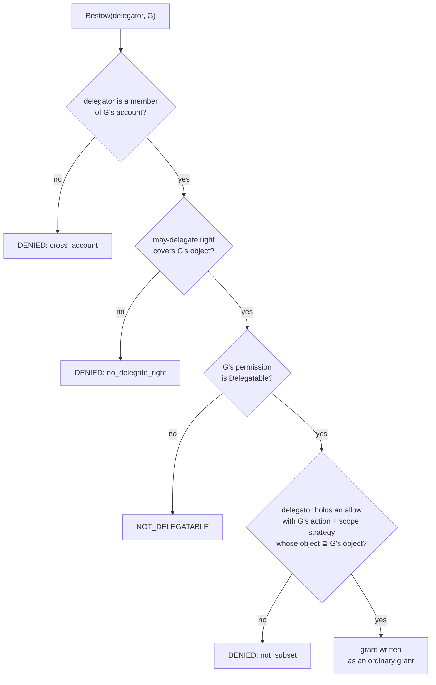

# Delegation ("bestow")

Delegation lets a principal hand a slice of the authority it *already holds* to
another principal — without privilege escalation and without crossing an account
boundary. Aperture calls the grant-forward operation **bestow** and its inverse
**revoke**. The code lives in the `delegation` package; drive it from the CLI
with [`bestow` / `revoke`](../cli/mutations.md#delegation-bestow-and-revoke).

The defining property: a bestowed grant is an **ordinary account-scoped grant**.
There is no special storage and no special decision path — once bestowed, the
[engine](../library/decision-api.md) treats it exactly like any other grant, and
it vanishes outside its account like any other grant, because every grant query
is account-scoped.

## Delegation is itself a permission

There is no magic "admin can delegate" flag. The right to delegate is a normal
grant on a normal permission whose action is the reserved verb
`aperture.delegate` (`delegation.DelegateAction`). A principal "may delegate"
within an account when its effective grant set holds an **allow** grant on that
action whose object pattern **covers** the object being bestowed. So the right
to delegate is scoped exactly like every other permission — a delegate grant
over `account:acme/project:atlas/**` authorizes bestowing only within that
subtree.

An object type opts a resource into delegation by declaring the
`aperture.delegate` verb and defining a permission on it.

## The bestow rule

Bestow is **conjunctive and fail-closed**. A delegator may bestow a grant `G`
only when *all four* conditions hold, checked against the delegator's
`(delegator, account)` effective grant set:



1. **Account membership** — the delegator is a member of `G`'s account. A bestow
   stamped to any other account is rejected up front (a cross-account leakage
   guard, and defence in depth over the already account-scoped grant query).
2. **May-delegate** — the delegator holds an effective allow grant on
   `aperture.delegate` whose object pattern covers `G`'s object.
3. **Delegatable** — `G`'s underlying permission is flagged `Delegatable`. This
   is the [model](model.md#permissions)'s opt-in gate; a permission is
   non-delegatable until explicitly flagged.
4. **Subset** — the delegator holds an effective allow grant with the **same
   action *and* scope strategy** as `G`'s permission, whose object pattern
   covers `G`'s object. In other words, `G` must be a subset of the delegator's
   own authority — never broader.

Only **allow** grants may be bestowed; a delegated deny is out of scope. Any
failure returns an `APERTURE_DELEGATION_*` coded error naming the first broken
condition (`APERTURE_DELEGATION_DENIED` with a `reason`, or
`APERTURE_DELEGATION_NOT_DELEGATABLE`) and writes nothing.

### "Covers" is pattern containment

"⊇" throughout is `identity.Contains`: the target's object pattern must be
equal-or-more-specific than — that is, contained within — the delegator's. A
more-specific pattern under the delegator's authority is a subset; a
broader-or-disjoint one is not. The containment test is **conservative** (sound,
possibly incomplete): when authority cannot be *proven*, the bestow is denied. A
delegator holding a `deny` grant confers nothing to hand on — only allow grants
are considered when computing what the delegator may bestow.

## Revoke

`Revoke` is the inverse mutation and is gated by the **same** authority check
`Bestow` applies. A delegator may revoke only a grant it could itself bestow
*now* — so revocation can never be used to reach across accounts or beyond the
delegator's own scope. Revoking an unknown grant is `APERTURE_NOT_FOUND`.

## Worked example

Alice holds two allow grants in account `acme`: a delegate right and a read
right, both over `account:acme/project:atlas/**`, on a `Delegatable`
read permission. She bestows a narrower read grant on Bob:

```bash
export APERTURE_PRINCIPAL=alice
bin/aperture bestow --delegator alice --json '{
  "id": "g-bob-read-42",
  "accountId": "acme",
  "subject": {"kind": "principal", "id": "bob"},
  "permissionId": "perm-doc-read",
  "object": "account:acme/project:atlas/document:42",
  "effect": "allow"
}'
```

This passes all four checks: Alice is a member of `acme`; her delegate right
covers `document:42`; `perm-doc-read` is delegatable; and her own read grant
over `.../atlas/**` contains the narrower `.../atlas/document:42`. Had Bob's
object been `account:acme/project:atlas/**` (equal to or broader than Alice's),
the subset check would deny it.

## Related

- [The RBAC model](model.md) — grants, permissions, the `Delegatable` flag.
- [Identity patterns](identity.md) — how containment and specificity are decided.
- [CLI mutations](../cli/mutations.md#delegation-bestow-and-revoke) — the
  `bestow` / `revoke` commands.
- [The service facade](../library/service-facade.md) — how surfaces reach the
  gated delegation service.
