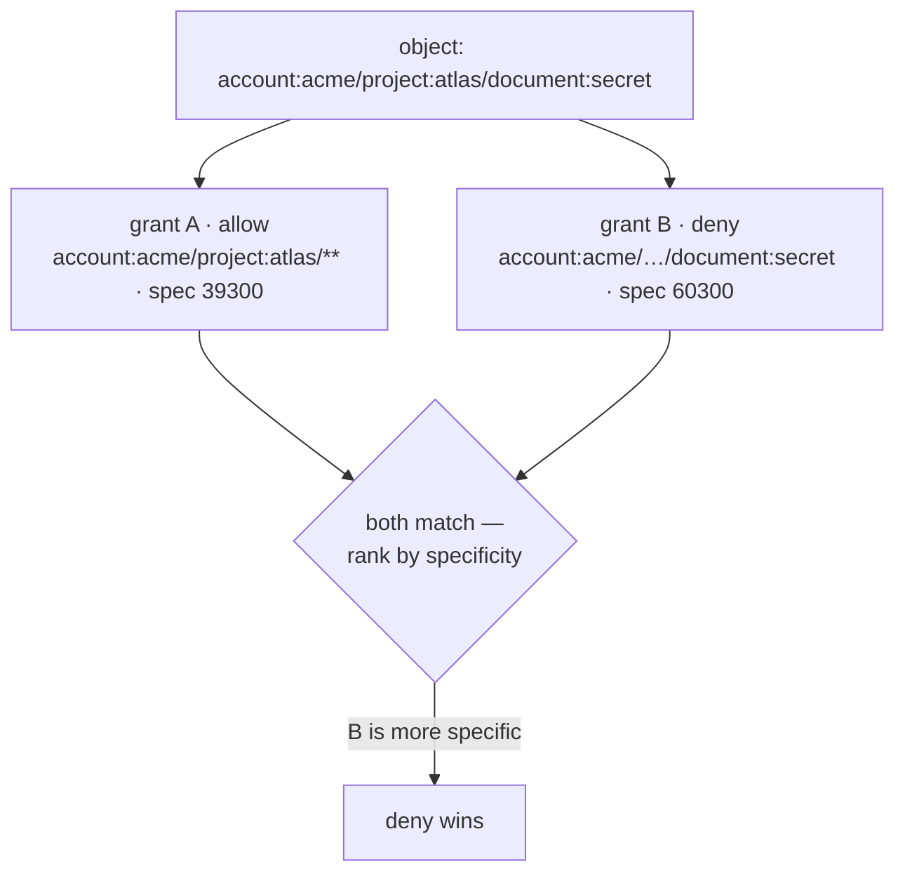

# Identity patterns & specificity

Everything Aperture decides is expressed in one primitive: a **uniform,
hierarchical identity**. The same type describes *principals* (the actor a
decision is made for) and *objects* (the resource an action targets), so there
is no second addressing scheme to learn. This chapter defines that primitive,
the **pattern** grammar a grant uses to cover many identities at once, the
`Contains` containment test delegation relies on, and the **specificity** score
that resolves overlapping matches.

If you have not read the [Concepts primer](../getting-started/concepts.md), skim
it first — it fixes the vocabulary (principal, object, grant, effect) this page
builds on. The code lives in the `identity` package.

## The identity primitive

An identity is an ordered path of typed **segments**. Each segment is a
`type:id` pair; segments are joined by `/`:

```text
account:acme/project:atlas/document:42
```

Read left to right, each segment narrows the path: account `acme`, then project
`atlas` within it, then document `42` within that. A principal is written the
same way — `user:alice` or `account:acme/team:eng` — because principals and
objects share the type.

The grammar is intentionally strict, and matching runs on the `Check` hot path
(the NFR target is p99 < 1 ms), so parsing validates without regular
expressions and stores segments pre-split so a match never re-parses:

- A segment's **type** and **id** are each non-empty.
- Allowed characters in a component are ASCII letters, digits, and `-._~@+` —
  enough for slugs, UUIDs, and qualified ids, while excluding the structural
  delimiters `/` and `:`, whitespace, and the `*` wildcard sentinel.
- An empty string, an empty segment (a leading, trailing, or doubled `/`), a
  segment missing its `:`, or an illegal character is rejected as an
  `APERTURE_IDENTITY_INVALID` coded error.

`identity.Parse` builds an `Identity` from its canonical string and round-trips
losslessly (`Parse(s).String() == s`); `identity.New` builds one from segments a
caller already holds. The `identity` package depends on nothing but the root
`errors/` package, so it stays a leaf every other layer resolves against.

```go
id, err := identity.Parse("account:acme/project:atlas/document:42")
if err != nil {
    // APERTURE_IDENTITY_INVALID
}
id.Len()        // 3
id.Segments()   // []Segment{{account,acme}, {project,atlas}, {document,42}}
```

## Patterns

A single grant rarely names one object. A **pattern** is an identity with
wildcards that describes a *set* of concrete identities; a grant's object scope
is a pattern. Build one with `identity.ParsePattern`. Beyond the concrete-identity
grammar, a pattern segment may be:

| Form | Meaning |
|---|---|
| `type:id` | a literal segment — matches exactly one segment with that type and id |
| `type:*` / `*:id` | a **component wildcard** — `*` in place of a type or id matches any value for that component |
| `type:{a,b,c}` | a **component set** — matches any of the listed values (e.g. `brand:{1,5,23}`) |
| `*` | a **single wildcard** segment — matches exactly one segment of any type and id |
| `**` | a **double wildcard** segment — matches one-or-more segments recursively |

A component set lets one grant scope to several ids without a wildcard, so
`brand:{1,5,23}` covers exactly three brands and nothing else. The set must be
non-empty (`{}` is rejected); duplicate members are dropped, preserving order.

### How a pattern matches

`Pattern.Matches(identity)` is **anchored at both ends**: every identity segment
must be consumed and every pattern segment satisfied. A literal or single `*`
each consume exactly one identity segment; `**` consumes one-or-more via
backtracking. The matcher slices into the pre-compiled segments and does not
allocate.

```text
Pattern                                     Matches?
account:acme/project:atlas/**               account:acme/project:atlas/document:42   ✓ (** = "document:42")
account:acme/project:atlas/**               account:acme/project:atlas               ✗ (** needs ≥1 segment)
account:acme/project:*/document:42          account:acme/project:atlas/document:42   ✓ (project id wildcard)
account:acme/brand:{1,5,23}                 account:acme/brand:5                     ✓ (5 ∈ set)
account:acme/brand:{1,5,23}                 account:acme/brand:9                     ✗ (9 ∉ set)
```

Because `**` must consume **at least one** segment, a pattern is never shorter
than the identities it matches minus its wildcard expansion — a trailing `**`
matches any non-empty remainder but not the empty one.

### Enumerating a finite pattern

When a pattern contains **no** `*` or `**` anywhere — every segment is a literal
whose components are plain literals or explicit sets — its language is finite.
`Pattern.Expand()` returns that concrete set as the deterministic cross-product
of each segment's members (segment order, then written member order), reporting
`ok=false` for any pattern with a wildcard (whose language is unbounded or
provider-dependent). This lets a set-scoped grant like `brand:{1,5,23}` list its
three concrete objects without consulting a [provider](providers.md).

## Specificity: resolving overlaps

Two grants can both match the same object with different effects — a broad
*allow* on `account:acme/project:atlas/**` and a narrow *deny* on
`account:acme/project:atlas/document:secret`. Aperture resolves this with
**deny-overrides ranked by specificity**: the more specific pattern wins, and on
a genuine tie deny beats allow. `identity.Specificity(pattern)` produces the
deterministic score that drives the tiebreak.

The score is a single weighted integer (paths are short, so there is no
overflow risk) built from three signals:

| Signal | Weight | Rationale |
|---|---|---|
| literal components (a fixed type or id) | `10000` each | a pinned value is the strongest specificity signal |
| total segment count | `100` each | a longer pinned path breaks ties among equal literal counts |
| each `**` | `−1000` penalty | a recursive wildcard matches a variable-length span, the least specific construct |

A `type:id` literal contributes up to two literal components; a component
wildcard (`*`) or a bare `*` segment contributes none (only its pinned
position). The result is that the pattern a human would call "more specific" —
more fixed components, fewer and shallower wildcards — always scores strictly
higher.

```text
Pattern                                        Specificity
account:acme/project:atlas/document:secret     6 literals·10000 + 3 segs·100      = 60300
account:acme/project:atlas/**                  4 literals·10000 + 3 segs·100 − 1000 = 39300
account:acme/**                                2 literals·10000 + 2 segs·100 − 1000 = 19200
```

`identity.Compare(a, b)` returns `+1 / -1 / 0` as a total, deterministic order
(safe as a sort key), and `identity.MoreSpecific(a, b)` reports whether `a`
ranks strictly above `b`. The decision engine consumes these directly; this
package never applies deny-overrides itself — it only supplies the ranking.



## Containment: `Contains`

Delegation asks a different question: *is one grant's authority a subset of
another's?* `identity.Contains(outer, inner)` answers it structurally — it
reports whether `outer`'s language is a **superset** of `inner`'s, i.e. every
concrete identity `inner` matches, `outer` matches too. Equivalently, `inner` is
"equal-or-more-specific / contained within" `outer`. `outer.Contains(inner)` is
the method form.

The test is **sound and conservative**: it never reports containment that does
not hold, but — because it is a structural check rather than a full language
inclusion decision over the one-or-more `**` — it may return `false` for some
genuinely-contained pairs. Delegation fails closed, so a false negative merely
rejects a bestow that could in principle have been allowed; it never permits an
escalation. It is reflexive (a pattern contains itself).

```text
Contains(account:acme/**,           account:acme/project:atlas/document:42)  = true
Contains(account:acme/brand:{1,5},  account:acme/brand:5)                    = true
Contains(account:acme/brand:{1,5},  account:acme/brand:{5,9})                = false (9 ∉ {1,5})
Contains(account:acme/*,            account:acme/**)                         = false (single can't cover ≥1)
```

For a component, an outer wildcard covers anything, an inner wildcard is never
subsumed by a fixed outer, and otherwise both reduce to finite value sets where
outer must contain every inner value — so `{1,5,23}` subsumes `5` and `{1,5}`
but not `3` or `{5,9}`.

## Where this leads

Patterns bound *what a grant covers*, but membership **within** that bound can
be more than literal matching — a grant can cover "every object of this type"
or "these ids only" or "whatever a rule selects." That is the job of
[scopes and scope strategies](scopes.md). The attributes a
[rule](rules.md) reads about an object are supplied by the host through
[providers](providers.md). For the end-to-end decision flow that consumes
specificity, see the [library Decision API](../library/decision-api.md).
