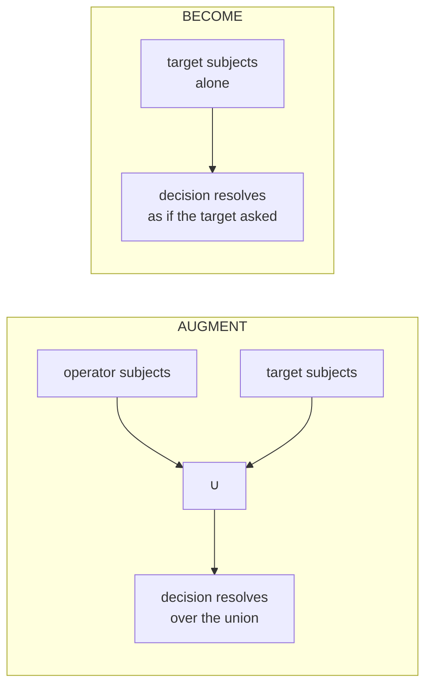

# Impersonation

Impersonation lets a privileged operator **borrow another principal's authority**
for a decision — to reproduce what a user sees, or to act on their behalf — under
hard guardrails and a strict time-box. This chapter is the conceptual half:
*what* the two modes mean, how a session is gated, and how it expires. For the
engine API that consumes a session (`CheckAs` / `EnumerateAs` / `ExplainAs` and
the `ImpersonationContext` shape), see the [library reference](../library/impersonation.md).

The feature has two halves. The `impersonation` package **starts and gates** a
session; the engine's `*As` entry points **consume** it. A session never mutates
stored grants — it only steers *which subject set* a decision resolves over.

## Two modes: augment vs become



- **Augment** *adds* the target's effective permissions to the operator's own.
  The operator keeps acting under its **own** identity, and the decision resolves
  over the **union** of both subject sets. Use it to "see what they can see"
  while retaining your own authority.
- **Become** *fully assumes* the target's identity: the decision resolves over
  the target's subject set **alone**, as if the target had asked. The operator's
  own grants do not apply.

Become is **strictly stronger** than augment, and that ordering drives the
gating rule below.

## Impersonation is a permission — and become needs the stronger right

Like [delegation](delegation.md), impersonation is gated by ordinary grants on
reserved action verbs. Two verbs gate the two modes:

| Mode | Reserved verb | Constant |
|---|---|---|
| Augment | `aperture.impersonate.augment` | `impersonation.AugmentAction` |
| Become | `aperture.impersonate.become` | `impersonation.BecomeAction` |

An operator "may impersonate" a target when its effective **allow** grant set
holds the mode's right whose object pattern **covers the target principal's
identity** (`identity.Contains`). The strictly-stronger rule:

- **Become** requires an allow on `aperture.impersonate.become` covering the
  target.
- **Augment** requires an allow on `aperture.impersonate.augment` **or**
  `aperture.impersonate.become` covering the target — so holding the become
  right implies the augment right (a become-holder can do either), but the
  augment right alone can *never* become a target.

An object type opts a principal type into being impersonable by declaring these
verbs and defining a permission on each.

## Starting a session: the guardrails

`Start(operator, target, account, mode)` gates and issues a session. The
guardrails are **conjunctive and fail closed** — every one must hold, checked
against the operator's `(operator, account)` effective grants:

1. **Account boundary** — *both* the operator and the target are members of the
   active account. A session spanning accounts is refused; there is no
   cross-account impersonation. (The engine independently re-checks this on every
   decision, so a forged context cannot bypass it.)
2. **Right held** — an effective allow grant on the mode's action (or, for
   augment, the stronger become action) whose object pattern covers the target's
   identity.

A failure returns `APERTURE_IMPERSONATION_DENIED` naming the failed guard in the
error context (`operator_not_member`, `cross_account`, `no_become_right`,
`no_augment_right`). Empty inputs or an unknown mode are `APERTURE_INVALID_INPUT`.

## Expiry: a hard, short time-box

Impersonation is a privileged, transient act, so every session carries an
expiry. `Start` stamps `ExpiresAt = now + ttl`, where `ttl` defaults to
`DefaultTTL` — **15 minutes** — and can be overridden per service with
`WithTTL` (a non-positive ttl is ignored, so a session is *always* bounded). The
clock is injected, so tests never touch the wall clock.

The `ExpiresAt` instant travels *with* the session into the engine, so the
engine enforces the time-box itself:

- A session presented after its expiry confers **no** elevation. Instead of the
  target's authority, the decision fails closed to the operator's **own**
  authority — an expired *become* never resolves as the target. Elevation never
  outlives its time-box.
- A surface that would rather reject an expired session up front — instead of
  silently resolving with no elevation — calls `Session.Live(now)`, which
  returns `APERTURE_IMPERSONATION_EXPIRED` once the session is past its expiry.

Every resulting decision records **both** the real operator and the effective
subject for the [audit layer](../surfaces/rpc-overview.md) — impersonation is
never silent.

## Starting one from the CLI

```bash
bin/aperture impersonate --operator root --target alice \
  --account acme --mode augment
```

This prints the session (operator, target, account, mode, and expiry) as JSON.
The command is guarded exactly as above: an operator with no right covering
`alice` is denied with `APERTURE_IMPERSONATION_DENIED`. See
[CLI mutations](../cli/mutations.md#impersonation-impersonate).

## Related

- [Library: Impersonation](../library/impersonation.md) — the `*As` engine API
  and the `ImpersonationContext` decorator this conceptual page complements.
- [The RBAC model](model.md) — subjects, grants, and reserved action verbs.
- [Delegation](delegation.md) — the sibling "grant a subset of your authority"
  feature, gated the same way.
- [The service facade](../library/service-facade.md) — how surfaces reach the
  gated impersonation service.
