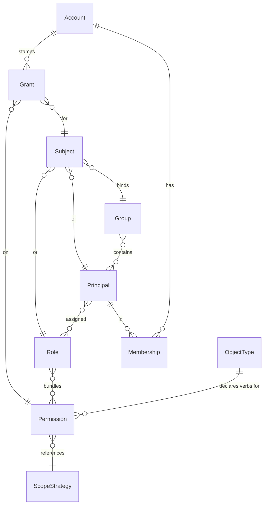

# The RBAC domain model

Every authorization decision Aperture makes is resolved against a small,
explicit graph of entities. They all live in the `model` package — the single
place the domain is defined, and the package every storage backend implements
through one `Storage` interface. The model couples only to the leaf packages
`errors/` and `identity/`; it holds no storage, engine, or transport concepts,
so this graph is the same whether you drive it from the [library](../library/overview.md),
the [CLI](../cli/mutations.md), Twirp, or MCP.

An **account is a `model` entity, not a package of its own** — tenancy is part
of the domain, documented alongside the rest here.

## The entities

| Entity | What it is |
|---|---|
| **ObjectType** | A protected resource type (e.g. `document`) with a declared, closed set of action verbs. |
| **Permission** | An `(action, scope-strategy)` pair bound to one object type; optionally `Delegatable`. |
| **Principal** | A user or machine, addressable by the [identity scheme](identity.md); carries its assigned `RoleIDs`. |
| **Role** | A named bundle of permissions; a principal is assigned roles, and a role may also be a grant subject. |
| **Group** | A collection of principals that can itself hold grants (be a grant subject). |
| **Account** | A first-class tenancy boundary: the unit a grant is stamped to and the context a decision is scoped to. |
| **Membership** | The edge linking a global principal to an account it belongs to. |
| **Grant** | Binds a *subject* to a permission, scoped to an object *pattern* and an *effect*, stamped to an account. |
| **Rule** | A named, persisted rule AST (see [Rules](rules.md)) a scope strategy can reference. |
| **Template** | A named, versioned bundle of parameterized grants for fast, consistent provisioning. |

## How they relate



A **Subject** is not a stored row of its own — it is a `{Kind, ID}` value
carried on the grant, where `Kind` is one of `principal`, `role`, or `group`.
At decision time the engine expands the request's principal into a *subject
set* — the principal itself, the roles on `Principal.RoleIDs`, and the groups
that list the principal — and resolves grants against that whole set.

## Object types and typed actions

An `ObjectType` names an identity-segment type and declares a **closed** verb
set in `Actions`. The verb set is authoritative: a `Permission` may only name
an action the object type declares. Declaring a permission against an
undeclared verb is rejected with `APERTURE_ACTION_UNDECLARED`. This
typed-action validation means a typo in an action never silently becomes an
unmatchable permission — it fails at write time.

```json
{ "name": "document", "actions": ["read", "write", "delete", "aperture.delegate"] }
```

An object type opts a resource into [delegation](delegation.md) or
[impersonation](impersonation.md) by declaring their reserved verbs
(`aperture.delegate`, `aperture.impersonate.augment`,
`aperture.impersonate.become`) and a permission on each.

## Permissions

A `Permission` is an `(action, scope-strategy)` pair bound to one object type.
The `ScopeStrategy` field is an opaque reference resolved by the [scope](scopes.md)
layer — it decides *which* objects within a grant's pattern the permission
reaches. The `Delegatable` flag is an **opt-in, fail-closed** gate: a
permission cannot be handed to another principal via [bestow](delegation.md)
until it is explicitly flagged, so the right to delegate never leaks to
permissions whose authors did not intend it.

## Grants: subject × permission × object × effect × account

The `Grant` is the binding that actually confers (or withholds) access. It is
the load-bearing entity, so its shape is worth reading closely:

- **Subject** — what the grant applies to: a principal, role, or group.
- **PermissionID** — the granted permission (which fixes the action and scope
  strategy).
- **Object** — an identity **pattern** in string form, e.g.
  `account:acme/project:atlas/**`. Wildcards and explicit id-sets
  (`brand:{1,5,23}`) are first-class, so one grant can scope broadly or to a
  handful of ids without many grants. The engine parses it with
  `identity.ParsePattern`.
- **Effect** — `allow` or `deny`. At decision time a matching **deny overrides**
  allows at equal-or-broader specificity, with a specificity tiebreak resolved
  by the [pattern](identity.md).
- **AccountID** — mandatory. It **stamps** the grant to one account.

### Accounts and the isolation invariant

Accounts are global entities, and a single principal can belong to more than
one (via `Membership`). The core tenancy rule is the **(principal,
active-account) isolation invariant**: a principal's grants in one account
*never* apply in another, because every grant query is account-scoped. A
`Membership` edge says only that a principal is *in scope* in an account — not
what it may do there (that is grants); the engine can optionally deny a request
whose principal is not a member of the active account, as defence in depth.

The lone, deliberate exception is the **account wildcard** `*`
(`model.AccountWildcard`): a grant stamped to `*` is loaded for decisions in
*every* account. It is not a real account — `ValidateAccount` rejects `*` as an
account id so no row can shadow the wildcard — and only a system-tier admin can
mint one.

> Because grants are account-stamped and queries account-scoped, error messages
> and decision output must never surface another account's data. Keep examples
> single-account.

## Templates: provisioning many grants at once

A `Template` is a named, versioned bundle of **parameterized** grants. It
declares typed `Params` (each a `segment` — an identity component — or a free
`string`) and a set of `TemplateGrant`s whose subject ids and object patterns
reference those params with `${name}` tokens. At apply time the params are
filled with concrete values, tokens are substituted, and the bundle **expands**
to a set of concrete `Grant`s stamped to a target account and applied
transactionally.

- A template is identified by the `(Name, Version)` pair; storing a new version
  keeps older ones intact, so an apply can pin a version while new provisioning
  uses the latest.
- Expansion is **all-or-nothing**: a missing, unknown, or ill-typed param — or
  any expanded grant that fails validation — aborts with no grants written, so a
  partial expansion can never be applied.
- The default grant-id prefix is `<name>-v<version>`, so re-applying with the
  same prefix upserts (idempotent provisioning) rather than duplicating.

Apply a template from the [CLI](../cli/provisioning.md); the same expansion runs
behind the Twirp and library surfaces.

## Rules

A `Rule` is a named, persisted decision AST stored verbatim as canonical JSON —
the exact serialization the [rules engine](rules.md) marshals. The model layer
keeps it opaque (a `json.RawMessage`) so it stays free of an engine dependency;
it validates only that the name is non-empty and the AST is a JSON object.
Type-checking and compilation are the rules engine's job. A [scope
strategy](scopes.md) names a rule to make membership rule-driven.

## Validation and persistence

Every entity has a `Validate*` function that runs before persistence — non-empty
ids, valid enum values, parseable identities and patterns, typed-action checks.
Structural failures are `APERTURE_INVALID_INPUT`; the specialized codes
(`APERTURE_ACTION_UNDECLARED`, `APERTURE_TEMPLATE_INVALID`,
`APERTURE_RULE_INVALID`, …) name the specific rule that was broken. The
`Storage` interface is the single seam behind which the in-memory and SQLite
backends live; validation guarantees a malformed entity never reaches the
decision hot path.

## Where this leads

- Mutate these entities from the shell: [CLI mutations](../cli/mutations.md).
- Grant a subset of your authority to someone else: [Delegation](delegation.md).
- Borrow another principal's authority: [Impersonation](impersonation.md).
- Turn a grant's pattern into a concrete object set: [Scopes](scopes.md).
- Resolve a request into a verdict: the [Decision API](../library/decision-api.md).
