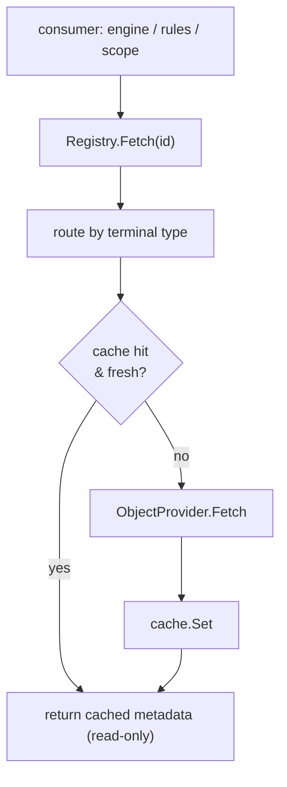

# Providers

A [rule](rules.md) reads `object.classification`; an [exclusive scope](scopes.md)
enumerates "every document in this account." Both need *domain data* Aperture
does not own. That data belongs to the **host application** — its database, its
API, its source of truth — and Aperture reaches it through **providers**. A host
implements one `ObjectProvider` per object-type; a `Registry` binds each type to
its provider plus a per-type cache and is the seam every consumer resolves
through. The code lives in the `provider` package; `csvprovider` is a concrete
worked example.

A load-bearing rule: **Aperture never persists provider data as a source of
truth.** The host owns it; Aperture only ever caches a copy. Cached metadata is
handed back **by reference and treated read-only** — the cache never copies a map
on read (allocation matters on the `Check` hot path), so a provider must return a
fresh map per object and callers must never write to a returned map.

## `ObjectProvider`: the host seam

A host implements this once per object-type. It is a pull source — Aperture asks,
the host answers — and must be safe for concurrent use:

```go
type ObjectProvider interface {
    Fetch(ctx context.Context, id identity.Identity) (Metadata, error)
    List(ctx context.Context) ([]Object, error)
    Query(ctx context.Context, filter Filter) ([]Object, error)
}
```

- **`Fetch`** returns one object's metadata; a missing object yields an
  `APERTURE_NOT_FOUND` coded error, so the Registry can tell "absent" from an
  operational failure.
- **`List`** is the unfiltered enumeration of the type.
- **`Query`** returns the objects matching a `Filter` — an optional `Pattern`
  (bounds results to matching identities), host-interpreted `Fields` predicates,
  and a `Limit`. The zero `Filter` selects everything (equivalent to `List`).

`Metadata` is `map[string]any` — an **alias**, not a named type — so the rules
engine reads each field straight into its expression environment with no
conversion layer. An `Object` pairs an identity with its metadata; the identity's
terminal segment type is the object-type the provider is registered under.

## The Registry: binding, cache, invalidation

`provider.NewRegistry()` returns an empty registry; `Register(objectType,
provider, opts...)` binds a provider to a type with a per-type cache (rejecting an
empty type, a nil provider, or a duplicate with `APERTURE_PROVIDER_INVALID`). The
registry is concurrency-safe: providers register at startup and are read on the
hot path under an `RWMutex`, and each per-type cache is independently safe.

`Registry.Fetch(ctx, id)` is the read path consumers use. It routes by the id's
terminal segment type (an unregistered type is `APERTURE_PROVIDER_UNREGISTERED`),
serves from the type's cache when fresh, and otherwise pulls through the provider
and caches the result — a cache hit never calls the provider. A host provider's
error is normalised by `providerError`: one already carrying an `APERTURE_*` code
passes through verbatim (so its `APERTURE_NOT_FOUND` reaches the caller intact),
while a plain error is wrapped as `APERTURE_PROVIDER_FETCH`.



The registry serves two other roles by matching contracts from other packages
**without importing them**:

- **`Fetch` is a `rules.MetadataFetcher`** — its signature is exactly what the
  [rules Engine](rules.md) wants for object metadata, so a `*Registry` is wired in
  as the fetcher directly.
- **`List(ctx, objectType, pattern, limit)` is a `scope.ObjectLister`** —
  byte-for-byte the seam the [implicit/exclusive scope resolvers](scopes.md) left
  open, so a `*Registry` is passed as `engine.ScopeDeps{Lister: reg}`. It queries
  the provider, bounds the result by the pattern and the limit
  (`DefaultListLimit` = 1000), and opportunistically warms the cache with each
  returned object's metadata.

Two enumeration variants sit beside the bounded `List`: `Identifiers` returns the
**complete, unbounded** id set (sorted, for a stable diff — use it to expand an
exclusive allowance into a positive allow-list), and `IdentifiersExcept` is
`Identifiers` minus an excluded set.

### Cache tuning and invalidation

Each type's cache is an in-memory LRU (`MemoryCache`) behind the pluggable
`CacheBackend` interface, tuned per type at registration:

| Option | Default | Effect |
|---|---|---|
| `WithTTL(d)` | `DefaultTTL` = 30s | freshness window; `d ≤ 0` disables expiry |
| `WithMaxSize(n)` | `DefaultMaxSize` = 10 000 | LRU cap; `n ≤ 0` means unbounded |
| `WithClock(now)` | `time.Now` | injectable clock for deterministic TTL tests |

Invalidation is explicit: `Invalidate(id)` drops one object, `InvalidateType`
clears a type, `InvalidateAll` clears every cache. `Stats(objectType)` exposes
`Hits / Misses / Evictions / Expirations / Invalidations / Entries` for
observability and the latency benchmark. The `provider` package depends only on
`identity` and `errors` — never scope, engine, or model — so it stays a leaf.

## Worked example: `csvprovider`

`csvprovider` implements `ObjectProvider` over a CSV file, so a host can wire real
object data during development before a database-backed provider exists. It is a
drop-in adapter: register a `*Provider` under an object-type exactly as a future
SQL-backed provider would be, and the Registry's cache, invalidation, and rules
wiring are unchanged.

```go
reg := provider.NewRegistry()
reg.MustRegister("brand", csvprovider.New("brands.csv"), provider.WithTTL(0))
reg.MustRegister("app",   csvprovider.New("apps.csv"),   provider.WithTTL(0))
// swapping to a database later changes only these two lines.
```

### File shape

The first row is a header. One column **must** be named `id` and holds each
object's canonical identity string; its terminal segment type is the object-type
the provider is registered under. Every other column becomes a metadata field
keyed by the column name. A column name may carry a `name:type` suffix so its
cells are coerced to a real type the rules engine reads natively:

```text
id,category_id,seats:int,active:bool,budget:float
brand:1,electronics,40,true,15000.50
brand:5,books,12,false,3000
brand:23,garden,,true,
```

Supported types are `string` (the default, no suffix), `int` (stored as `int64`),
`float` (`float64`), and `bool`. An **empty cell omits that field** for the row,
so a rule can supply its own default (row `brand:23` above has no `seats` or
`budget`). A missing `id` column, a duplicate id, a wrong column count, or a value
that will not coerce to its declared type is an `APERTURE_CONFIG_INVALID` error; a
malformed id passes through as the identity package's `APERTURE_IDENTITY_INVALID`.

### Loading and the read-only contract

The file is read **once, lazily**, on the first `Fetch`/`List`/`Query` and held
in memory. `New(path)` never fails at construction — a bad file surfaces on first
use (the file may not exist yet at wiring time). `FromReader(r)` builds an
already-loaded provider from any reader (embedded data, tests). `Reload`
re-reads the file, building a **fresh** set and swapping it in atomically, so maps
already handed to and cached by the Registry stay immutable — honouring the
"metadata is read-only" contract. After a `Reload`, call
`Registry.InvalidateType` to drop the now-stale cache entries.

`Query` honours `Filter.Pattern` and `Filter.Limit` directly and matches
`Filter.Fields` by string-equality (a field absent from an object never matches).
The Registry re-enforces the pattern and limit, so honouring them in the provider
is an optimisation that also keeps `Query` correct when called standalone.

Like the core packages, `csvprovider` imports only `errors`, `identity`, and
`provider` plus the standard library — pure-Go and CGO-free.

## Where this leads

Providers feed two consumers documented elsewhere: the object metadata a
[rule](rules.md) reads, and the object enumeration an
[implicit/exclusive scope](scopes.md) performs. For the CLI that inspects
registered providers, see the [provisioning commands](../cli/provisioning.md).
