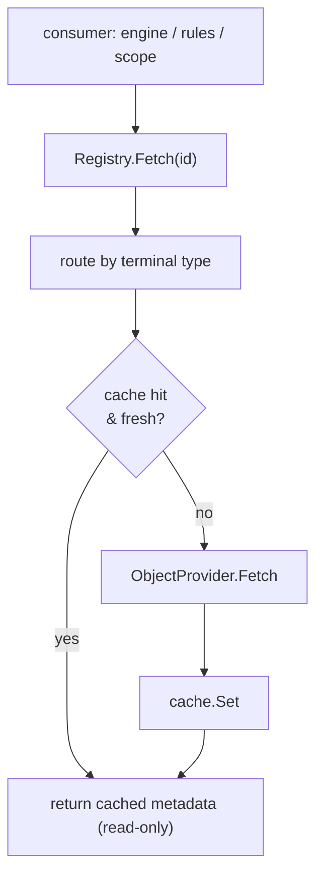

# Providers

A [rule](rules.md) reads `object.classification`; an [exclusive scope](scopes.md)
enumerates "every document in this account." Both need *domain data* Aperture
does not own. That data belongs to the **host application** — its database, its
API, its source of truth — and Aperture reaches it through **providers**. A host
implements one `ObjectProvider` per object-type; a `Registry` binds each type to
its provider plus a per-type cache and is the seam every consumer resolves
through. The code lives in the `provider` package; `csvprovider` (a file) and
`sqlprovider` (a database) are the two concrete worked examples.

There are **two** provider seams, and this page covers both. An `ObjectProvider`
describes the thing being acted on; an [`AttributeProvider`](#attribute-providers)
describes the party **asking** — the principal and the account a rule reads
`principal.*` and `account.*` out of. They share one value model and one cache
design, and differ in everything that follows from an attribute key being a bare
opaque id rather than a segmented identity.

A load-bearing rule: **Aperture never persists provider data as a source of
truth.** The host owns it; Aperture only ever caches a copy. Cached metadata is
handed back **by reference and treated read-only** — the cache never copies a map
on read (allocation matters on the `Check` hot path), so a provider must return a
fresh map per object and callers must never write to a returned map. Because a
value may nest, that contract is **transitive**; see
[the read-only contract](#the-read-only-contract-is-transitive) below.

## `ObjectProvider`: the host seam

A host implements this once per object-type. It is a pull source — Aperture asks,
the host answers — and must be safe for concurrent use:

```go
type ObjectProvider interface {
    Fetch(ctx context.Context, id identity.Identity) (Metadata, error)
    List(ctx context.Context) ([]Object, error)
    Query(ctx context.Context, filter Filter) ([]Object, error)
}
```

- **`Fetch`** returns one object's metadata; a missing object yields an
  `APERTURE_NOT_FOUND` coded error, so the Registry can tell "absent" from an
  operational failure.
- **`List`** is the unfiltered enumeration of the type.
- **`Query`** returns the objects matching a `Filter` — an optional `Pattern`
  (bounds results to matching identities), a set of `Fields` predicates, and a
  `Limit`. The zero `Filter` selects everything (equivalent to `List`).

`Metadata` is `map[string]any` — an **alias**, not a named type — so the rules
engine reads each field straight into its expression environment with no
conversion layer. An `Object` pairs an identity with its metadata; the identity's
terminal segment type is the object-type the provider is registered under.

### The `Filter.Fields` contract

A provider *evaluates* `Fields`, but it does not get to *define* it. `Query` is
how [scope](scopes.md) enumeration bounds itself, so two providers disagreeing
about what `Fields{"tags": "premium"}` selects is two different answers to the
same authorization question. The rule is stated once on `provider.Filter` and
implemented once in `provider.MatchFields`; an implementation either calls that
helper or reproduces it exactly (by pushing the predicate into SQL, say).

| Field value | Want | Rule |
|---|---|---|
| `["premium","launch"]` | `"premium"` | **membership** — true |
| `["premium-trial"]` | `"premium"` | membership — **false**, never substring |
| `[3, 5]` (`int64`) | `5` | membership — true |
| `[3, 5]` (`int64`) | `"5"` | **false** — a number is not its string spelling |
| `"gold"` | `"gold"` | equality — true |
| `{"dept":"eng"}` | `"dept"` | equality — **false**, *not* key membership |
| `{"dept":"eng"}` | `{"dept":"eng"}` | equality — true |
| *(field absent)* | anything, `nil` included | **false** |

Three properties are worth stating outright, because each one closes a failure
mode:

- **A collection field matches by membership.** Equality against a whole array
  is never what a caller filtering on a tag list means, and the predicate this
  replaced compared against the array's *literal rendering* (`[premium launch]`),
  so a tag filter could not match anything useful.
- **Comparison is typed, not stringly.** Numbers compare across Go numeric types
  by value (`int(5)`, `int64(5)`, `float64(5)` are one value), but a number never
  equals `"5"` and a string equals only a string. These are the [rules
  engine](rules.md)'s own comparison semantics, so `Enumerate` cannot select an
  object that a `Check` over the same value then denies. `provider.ValuesEqual`
  is the exported leaf comparison, and `csvprovider`'s
  `membership_equivalence_test.go` runs it against a real compiled rule to keep
  the two from drifting.
- **Every predicate must hold** (the map is an AND), and an object field is
  compared *by equality*, never by key membership — so a scalar want against one
  is a plain `false`, not a panic and not an accidental rendering match.

The contract reaches past `Query`. `Enumerate`'s own metadata filter
(`engine.EnumerateRequest.Fields`, and its `EnumerateQuery.Fields` /
`--field` / `--fields-json` / Twirp `fields` / MCP `Fields` spellings) is
evaluated by this same `provider.MatchFields`, so an enumeration filtered by the
engine and one filtered inside a provider select the same objects. There the
filter runs on candidates that already survived deny-overrides, and it runs
*before* the enumeration's `Limit` — see
[the decision API](../library/decision-api.md#filtering-by-object-metadata).

Because `provider` is a strict leaf (`identity` + `errors` + stdlib), `ValuesEqual`
**reimplements** the evaluator's equality rather than importing `expr-lang`. It
agrees with it on every value the metadata value model admits; the two documented
divergences — `time.Time`/`time.Duration`, and a `uint64` above `math.MaxInt64` —
are both outside that model.

### The text-match contract

`Fields` answers "which objects hold exactly this value?". The properties that
make it trustworthy — exact, typed, coercion-free — are precisely what stop it
answering the other question a caller has: *"which objects are people naming when
they type `nike`?"*, where `Nike`, `nike`, `Nike, Inc.` and a typo are one intent
and none of them is an exact value.

`provider.MatchText(md, query, fields)` is that second question, and it lives
beside `MatchFields` for the same reason: a host that can push a search down into
its own storage — a SQL `LIKE`, a trigram index, an external search engine — must
be able to rank the way Aperture would, or the ids it proposes and the ids
Aperture would have proposed are two different answers to one question.
`provider.ScoreText` and `provider.NormalizeText` are exported for exactly that.

It reads the same value model, and only the **string** material in it:

| Field value | Searched? |
|---|---|
| `"Nike, Inc."` | yes |
| `["Nike","NIKE Inc"]` | yes — each **element** scored separately, and a match reports the element |
| `42`, `true`, `nil` | no — filtering by one of those is `Fields`' job |
| `{"dept":"eng"}` | no — a match *names* its field, and a nested path is not a field name a caller could restrict to |

Both sides are normalised first — lower case, every non-alphanumeric rune a
separator, runs collapsed — which is what makes `"Nike, Inc."` and `"nike inc"`
the same string. Each query token then scores its best match against any
candidate token in descending tiers (exact, prefix, substring, approximate), the
base score is their mean, and that is scaled by how much of the candidate the
query accounts for, so `"nike"` ranks `Nike Inc` above `Nike Air Max Collection`.
Approximate matching uses Damerau-Levenshtein distance, so a transposition counts
as the one slip it is; tokens shorter than four runes must be spelled exactly or
be a prefix, because one edit in three characters would let `IBM` answer for
`IBN`.

Nothing in Aperture ever *decides* on a score. The surface that consumes this —
`Search` — applies it only to candidates the engine has already decided the
subject may act on. See [object search](../library/decision-api.md#search).

## The metadata value model

`Metadata` is an alias, so the *type* constrains nothing. The **shape** of a field
value is constrained anyway, and deliberately so: metadata goes into the
expression evaluator untranslated, which means a wrong shape is not a `false`
decision — it is a *runtime evaluation error* on the `Check` hot path
(`operator "in" not defined on string`). Catching that at load is the whole point
of the model.

A field value is one of:

| Kind | Go type | Example |
|---|---|---|
| **scalar** | `nil`, `bool`, `string`, any Go integer/float, `json.Number` | `classification: "secret"` |
| **array** | `[]any` whose elements are **all scalars** | `tags: ["eng", "oncall"]` |
| **object** | `map[string]any` of scalars, scalar arrays, or one further object level | `owner: {dept: "eng"}` |

Two rules bound it:

- **Arrays of objects are rejected at any position.** Rule authors compare against
  arrays with `in` / `not in`, which has no useful meaning over a list of maps.
  Nested arrays (`[["a"]]`) are rejected for the same reason.
- **Typed containers are rejected** — `[]string`, `map[string]string`, structs.
  The model is spelled in the two types the expression environment and JSON share,
  so a loader normalises once instead of every consumer type-switching.

`time.Time` is deliberately **not** a scalar: a rule literal is a JSON scalar and
could never be compared against one, so a loader formats timestamps as RFC 3339
strings.

### Dates are string scalars, in two canonical forms

A date is **not a fourth shape** — it is a string scalar a loader has been told is
a date. Such a string must be one of exactly two forms, both UTC:

| Form | Layout | Example |
|---|---|---|
| calendar day | `2006-01-02` | `2026-03-04` |
| timestamp | `2006-01-02T15:04:05Z` | `2026-03-04T01:02:03Z` |

Granularity is carried by the string itself, so no type tag travels beside the
value. An offset-free timestamp is read as UTC and fractional seconds are
**truncated**, never rounded. An **explicit offset is rejected** rather than
converted: a host writing `2026-01-01T00:00:00+05:00` means January 1st, but the
UTC instant is `2025-12-31T19:00:00Z`, so accepting it would silently move the
calendar day and year.

The value model itself stays date-blind — `ValidateField` cannot know which
strings a host means as dates, so it keeps accepting any string. Declaring a
field to be a date, and running its values through `provider.ParseDateValue`, is
a loader's job — in `csvprovider` that is the
[`:date` / `:datetime` column suffix](#date-columns), and in a seed document the
[`field_types:` section](seed.md#declared-field-types). A rejection is
`APERTURE_CONFIG_INVALID` carrying a machine-
readable `reason` (`provider.DateReasonOf`) and never the value, because a date
can be personal data. Comparison goes through `DateValue.Compare`, which compares
**instants**: `"2026-03-04"` and `"2026-03-04T00:00:00Z"` are the same moment but
sort differently as text, so comparing the stored strings would be wrong at
exactly that boundary.

### Depth, counted below the field root

`provider.ValueDepth(v)` reports a value's container depth: every array or object
entered adds one level, so a scalar is `0` and an empty container is `1`. The cap
is **2** by default.

| Value | Depth | Legal? |
|---|---|---|
| `tags: ["a", "b"]` | 1 | yes |
| `owner: {dept: "eng"}` | 1 | yes |
| `owner: {lead: {name: "x"}}` | 2 | yes |
| `owner: {tags: ["a"]}` | 2 | yes |
| `owner: {a: {b: {c: "x"}}}` | 3 | no — past the depth cap |
| `owner: {members: [{id: 1}]}` | 3 | no — array of objects |
| `tags: [{name: "a"}]` | 2 | no — array of objects |

### Size, measured structurally

`provider.ValueBytes(v)` measures a value without serialising it (nothing is
allocated on a load path): a string costs its length in **bytes**, a number 8, a
bool 1, `nil` 0, an array the sum of its elements, and an object the sum of
`len(key) + value` per entry. Container framing costs nothing. The cap is **64
KiB per field value** by default.

### Validating at load

Validation is **load-time**, in one place, called by every loader — CSV today,
the inline seed next, a database-backed provider later. That is what lets a new
loader inherit the semantics instead of renegotiating them.

```go
// defaults: depth 2, 64KiB per value
if err := provider.ValidateMetadata(md); err != nil { return err }

// or tune the caps — the zero ValueLimits means "the defaults", and any
// field left zero keeps its default
limits := provider.ValueLimits{MaxDepth: 3}
if err := limits.ValidateMetadata(md); err != nil { return err }

// one field at a time, for a loader that reports per-column
err := provider.ValidateField("tags", []any{"eng", "oncall"})
```

A violation is `APERTURE_METADATA_INVALID`. Its context carries the **field
name**, the **path within the value** (`owner.members[0]`), and the offending Go
**type** — never the value itself, so a validation failure can be logged and
surfaced without leaking one account's data into another's diagnostics. Fields
and object keys are walked in sorted order, so a document with several offenders
always reports the same one.

### The read-only contract is transitive

Once a value can nest, "cached metadata is read-only" has to reach all the way
down. The cache stores the provider's map **by reference** and never copies it on
read, so the nested maps and slices inside it are shared too — appending to a
`[]any` you got back races every other reader exactly as writing the top-level
map would.

- A provider returns a **fresh** map per object, with fresh nested containers. It
  must not hand out a value it also retains and mutates, and reloading a source
  builds a new value rather than editing the old one in place.
- **No holder** — engine, rules, scope, CLI, server, host code — writes to a
  `Metadata` it was given, **at any depth**.
- A consumer that needs to modify metadata copies it (deeply) first.

## The Registry: binding, cache, invalidation

`provider.NewRegistry()` returns an empty registry; `Register(objectType,
provider, opts...)` binds a provider to a type with a per-type cache (rejecting an
empty type, a nil provider, or a duplicate with `APERTURE_PROVIDER_INVALID`). The
registry is concurrency-safe: providers register at startup and are read on the
hot path under an `RWMutex`, and each per-type cache is independently safe.

`Registry.Fetch(ctx, id)` is the read path consumers use. It routes by the id's
terminal segment type (an unregistered type is `APERTURE_PROVIDER_UNREGISTERED`),
serves from the type's cache when fresh, and otherwise pulls through the provider
and caches the result — a cache hit never calls the provider. A host provider's
error is normalised by `providerError`: one already carrying an `APERTURE_*` code
passes through verbatim (so its `APERTURE_NOT_FOUND` reaches the caller intact),
while a plain error is wrapped as `APERTURE_PROVIDER_FETCH`.


```mermaid
flowchart TD
    C["consumer: engine / rules / scope"] --> F["Registry.Fetch(id)"]
    F --> T["route by terminal type"]
    T --> H{"cache hit<br/>& fresh?"}
    H -->|yes| R["return cached metadata (read-only)"]
    H -->|no| P["ObjectProvider.Fetch"]
    P --> S["cache.Set"]
    S --> R
```

The registry serves two other roles by matching contracts from other packages
**without importing them**:

- **`Fetch` is a `rules.MetadataFetcher`** — its signature is exactly what the
  [rules Engine](rules.md) wants for object metadata, so a `*Registry` is wired in
  as the fetcher directly.
- **`List(ctx, objectType, pattern, limit)` is a `scope.ObjectLister`** —
  byte-for-byte the seam the [implicit/exclusive scope resolvers](scopes.md) left
  open, so a `*Registry` is passed as `engine.ScopeDeps{Lister: reg}`. It queries
  the provider, bounds the result by the pattern and the limit, and warms the cache
  with each returned object's metadata **when the provider promises the two bags
  are the same bag** — see
  [The listing and the fetch must be the same bag](#the-listing-and-the-fetch-must-be-the-same-bag).
  A **positive caller limit is honoured verbatim**, however large;
  `DefaultListLimit` (= 1000) is the value substituted for a limit `<= 0`, not a
  ceiling. The caller is the authority because the bound on a decision path is set
  one layer up — the engine's configured enumerate limit, which every network
  surface sits behind. A direct Go embedder calling
  `reg.List(ctx, t, pat, 1_000_000)` receives a million identities; the library is
  sharp-edged on purpose.

Two enumeration variants sit beside the bounded `List`: `Identifiers` returns the
**complete, unbounded** id set (sorted, for a stable diff — use it to expand an
exclusive allowance into a positive allow-list), and `IdentifiersExcept` is
`Identifiers` minus an excluded set.

### The listing and the fetch must be the same bag

Every **read** of the per-type cache is a `Fetch` — the decision path's
authoritative view of an object, what a rule sees as `object.*` and what an
`Enumerate`'s `Fields` predicate is tested against. An entry a listing wrote is
served back through that seam indistinguishably from one `Fetch` produced. So an
enumeration may only warm the cache when the listed bag is the bag `Fetch` would
have returned, and nothing in `ObjectProvider` makes that true:

```yaml
get_one: SELECT tier, seats, renews_on FROM brands WHERE id = $1
get_all: SELECT 'brand:' || b.id AS id, b.tier FROM brands b   # NARROWER
```

That is a legal, documented pair — `Config.FetchQuery` and `Config.ListQuery` are
independent statements, and a deliberately narrow listing over a wide table is a
reasonable thing to write. Warming from it caches a one-field bag under an id whose
real bag has three, for the whole of the type's TTL. A rule then reads
`object.seats` as **absent** — not wrong, absent — and every predicate over an
absent field is false: an inclusive grant **denies**, and an **exclusive** grant
stops excluding and therefore **widens**. Nothing in any verdict, trace or note says
why, because a bag of any shape is a legal bag. A listing **wider** than the fetch
statement is the mirror image: it caches a field `Fetch` would never produce, which
compares true until the entry expires and false afterwards.

The promise is therefore explicit and opt-in:

```go
// Implemented by an ObjectProvider that guarantees the Metadata its List and
// Query return is the bag its own Fetch would return, for every object.
type FetchCompleteLister interface {
	ObjectProvider
	ListedMetadataMatchesFetch() bool
}
```

A provider that does not implement it makes no promise, and a listing through it
warms **nothing** — the restrictive default. It costs one enumeration's worth of
fetches per TTL window and stays correct; a slower decision is an operational
problem, where a decision computed from a bag no statement of the host's produces is
an authorization one.

| Provider | Answer | Why |
|---|---|---|
| `provider.Static` | always `true` | one map per object, handed to `Fetch`, `List` and `Query` alike |
| `csvprovider` | always `true` | one parse of one file behind all three methods |
| `sqlprovider` | **derived** | the list statement's columns minus the id column must equal the fetch statement's columns, as a set — `false` until both statements have run once |
| a host's own | `false` unless it implements the interface | a provider that reads both answers from one row mapper can promise; one serving `Query` from a search index and `Fetch` from the system of record must not |

`sqlprovider` derives rather than declares because it can: `rows.Columns()` is the
statement's SELECT list, so it is the same for every row and unaffected by any row's
NULLs — where comparing two *bags* would not be, since a NULL column omits its field
and an omitted field is indistinguishable from an unprojected one. There is no
config field and no YAML key for it: an operator's unchecked promise about two
statements is exactly what this replaces. The practical cost is one cold enumeration
per process per SQL-backed type — its candidates each fetch, which is what teaches
the fetch projection — after which every enumeration warms as before.

The registry cannot verify the promise itself, which is why it is asked rather than
checked. Metadata is opaque host data, one object's bags agreeing proves nothing
about the next object's, and comparing per object would cost the very `Fetch` the
warm exists to avoid.

### Cache tuning and invalidation

Each type's cache is an in-memory LRU (`MemoryCache`) behind the pluggable
`CacheBackend` interface, tuned per type at registration:

| Option | Default | Effect |
|---|---|---|
| `WithTTL(d)` | `DefaultTTL` = 30s | freshness window; `d ≤ 0` disables expiry |
| `WithMaxSize(n)` | `DefaultMaxSize` = 10 000 | LRU cap; `n ≤ 0` means unbounded |
| `WithClock(now)` | `time.Now` | injectable clock for deterministic TTL tests |

Invalidation is explicit: `Invalidate(id)` drops one object, `InvalidateType`
clears a type, `InvalidateAll` clears every cache. `Stats(objectType)` exposes
`Hits / Misses / Evictions / Expirations / Invalidations / Entries` for
observability and the latency benchmark. The `provider` package depends only on
`identity` and `errors` — never scope, engine, or model — so it stays a leaf.

## Attribute providers

An `ObjectProvider` answers *"what do you know about this **object**?"*. An
**`AttributeProvider`** answers *"what do you know about the party **asking**?"*
— the principal's department and clearance, the account's plan and region — so a
rule can be written about the asker instead of only about the thing being acted
on:

```text
principal.kind == "user" && principal.department == object.department
account.plan == "enterprise"
```

The two seams are not variants of each other, and the difference is the fan-out.
Object metadata is resolved **per object**: a decision touching a thousand
objects reads a thousand bags, each describing something different. An attribute
bag is resolved **once per decision** and then read by every rule against every
object in it. Almost everything below follows from that.

### The three slots, and there is no fourth

`provider.AttributeSlot` is a **closed** set:

| Slot | Constant | Keyed by | Backs |
|---|---|---|---|
| `user` | `AttributeSlotUser` | a bare principal id | `principal.*` for a human principal |
| `machine` | `AttributeSlotMachine` | a bare principal id | `principal.*` for a service account, API client, or job runner |
| `account` | `AttributeSlotAccount` | a bare account id | `account.*` for the tenancy a decision is made in |

The object `Registry` is an **open**, type-keyed map because the host's object
types are the host's business. The slots are not: they are the parties a decision
has, and a decision has exactly these. An open map would let a host register a
fourth "kind" of subject nothing in the engine knows how to fetch — discovered at
evaluation time as an empty bag, which is to say as a silent denial. A further
distinction is a **field in the bag**, never a fourth slot. `user` and `machine`
are separate slots because in every host that has both, the two are served by
different systems.

The interface is three methods, and the key is the whole difference from an
object provider:

```go
type AttributeProvider interface {
	Fetch(ctx context.Context, id string) (Metadata, error)
	List(ctx context.Context) ([]AttributeRecord, error)
	Query(ctx context.Context, filter AttributeFilter) ([]AttributeRecord, error)
}
```

An `AttributeRecord` pairs one **bare string key** with a `Metadata` bag. An
object identity is a segmented path (`account:acme/project:atlas/document:42`)
precisely so a scope can contain and pattern-match it; an attribute key is an
opaque handle into the host's directory with no hierarchy to spell and no
containment relation to anything. A provider returns `APERTURE_NOT_FOUND` for a
key it does not know, must be safe for concurrent use, and owes the same
[transitively read-only contract](#the-read-only-contract-is-transitive) an
object provider owes — more strictly, in fact, because one attribute bag is
shared across every object in a decision and every concurrent decision for that
subject.

The bag **is** a `provider.Metadata`: the same [value
model](#the-metadata-value-model), the same depth and size caps, the same
`ValidateMetadata`, the same two canonical date forms, the same number
normalisation in every loader. There is no second model, so
`principal.clearance == 3` answers identically whether the bag was authored in
YAML, read from a CSV `:int` column, or read from a SQL `integer`.

### The registry, the two layers, and the revocation window

`provider.AttributeRegistry` binds each slot to a provider plus **its own**
cache — its own TTL, size cap, and counters — because the three slots have
genuinely different change rates and cardinalities:

```go
attrs := provider.NewAttributeRegistry()
attrs.MustRegister(provider.AttributeSlotUser, dir, provider.WithTTL(60*time.Second))
attrs.MustRegister(provider.AttributeSlotAccount, tenants)
```

A slot holds up to **two** providers, in two named layers, and the method picks the
layer. `Register` / `MustRegister` fills the **shared** layer
(`provider.AttributeLayerShared`) — the deployment's own wiring: a shared wiring row,
a seed `attribute_providers:` entry, the one directory a host administers fleet-wide.
`RegisterLocal` / `MustRegisterLocal` fills the **local** layer
(`AttributeLayerLocal`) — this instance's own: a seed `attributes:` block, or a
provider this binary registers for itself.

A fetch reads the two layers' **merge**, and the **shared layer wins every key both
serve**. The local layer can only *add* keys the shared layer does not serve, never
change one it does — because a rule is written against a **deployment**, and if a
local bag could override a shared key then a file on one machine would change what
`principal.clearance >= 3` compares against on that machine only: the same rule, a
different verdict, with nothing in a verdict or a trace to say which layer answered.
The precedence is fixed and does not depend on registration order. It is the engine's
[floor bag](rules.md#the-floor-bag-and-principalkind) one tier down, floor included:
the winner is stamped last over a fresh map and the floor then stamps over both, so
the tiers compose in one direction — **floor over shared over local**.

A second registration **in the same layer** is still **refused**, not replaced: "last
writer wins" is how one deployment's directory quietly shadows another's during
wiring, and the failure then surfaces as attributes that are merely *wrong* rather
than absent. A slot therefore accepts exactly two providers and a third is
`APERTURE_ATTRIBUTE_PROVIDER_INVALID` whichever layer it names. A slot with only one
registration behaves exactly as it always did — one provider, one cache, the bag
verbatim — whichever layer it sits in, and a slot left unregistered is not an error:
a deployment with no machine principals wires no machine provider.

Each **layer** caches independently, and that is deliberate: a layer's TTL is its own
revocation window, declared by whoever declared that layer, so one pooled cache per
slot could honour at most one of two declarations. Taking the longer window would
silently lengthen the time a revoked shared attribute keeps authorizing; taking the
shorter one would silently ignore a declaration an operator made. `CacheConfigFor`
reports the governing (shared, when filled) layer's configuration,
`CacheConfigForLayer` one layer's, and `Stats` sums them — so a key both layers serve
counts twice, because it really is cached twice.

Staleness is not only a tuning knob here. An object's metadata going stale for a
TTL is usually tolerable: a document's category is a fact about a thing. An
attribute bag is the **asker's standing** — the clearance, the department, the
plan — so until a cached bag expires, every decision about that subject is made
against access the host may have **already taken away**. Pick a slot's TTL for
how fast its revocations must land, and close the window explicitly when you
cannot wait: `Invalidate(slot, id)` drops one subject (and reports whether an
entry was present), `InvalidateSlot(slot)` a whole directory, `InvalidateAll()`
everything. All three clear **every layer** of every slot they name — clearing one
and leaving the other would be worse than not clearing at all, since the operator has
been told the window is shut while half of it is open. Invalidation is
**process-local**: it clears the caches of the process that runs it and cannot reach a
different one.

### Leniency: a missing bag decides, a broken directory does not

The registry satisfies the rules engine's two resolver seams structurally,
without importing `rules`:

```go
eng := rules.NewEngine(ruleSource, objectRegistry,
	rules.WithPrincipalResolver(attrs),  // Attributes(ctx, kind, principal)
	rules.WithAccountResolver(attrs))    // AccountAttributes(ctx, account)
```

Two outcomes are **lenient** — they yield a nil bag and *no error*, so the
decision proceeds against the engine's [floor
bag](rules.md#the-floor-bag-and-principalkind):

- the slot has no registered provider, or the principal's kind names no principal
  slot at all;
- a registered provider has no record for this key (`APERTURE_NOT_FOUND`).

Everything else — an unreachable directory, a bag the value model rejects —
surfaces **verbatim**, keeping its code and its registry fixups, and every
consumer treats it as a **non-decision**. That distinction is the point of the
seam: an outage must not read as "this principal has no attributes", because that
is an authorization change wearing an infrastructure failure's clothes.

Leniency is asked of the **slot**, not of a layer, and two layers do not widen it.
Inside a fetch, one layer's `APERTURE_NOT_FOUND` means only *this layer* has no record
for the key, and the other layer's bag is the answer; every other error surfaces
verbatim from whichever layer raised it, so an unreachable shared directory is never
quietly answered out of the local file.

Leniency leaves one hazard, and it is accepted rather than solved. An absent
attribute makes every comparison against it **false**. In an **inclusive** grant
that is deny-safe. In an **exclusive** grant, selection means *excluded* — so a
rule that quietly stops selecting stops excluding, and the object the exclusion
was written to withhold becomes covered, with nothing in the verdict saying so.
The mitigations are visibility, not refusal: `principal.kind`, so an author can
state a rule's kind-dependence out loud, and the `attributes_floor_only`
[evaluation note](rules.md#evaluation-notes), so a trace says the bag was empty.

**A principal bag is global, and keeping it account-neutral is a host
obligation.** A fetch is keyed by the bare principal id alone — it carries no
account — so one principal's bag is visible to rules evaluating in **every**
account that principal is a member of. Facts about the person or the machine are
account-neutral; facts about the person *in one tenancy* are not, and putting one
in a principal bag publishes one account's data into every other account that
principal touches. Aperture cannot detect it: the values are opaque host data.
Per-tenant facts belong on the **account** slot, which is bounded — the account
bag is always resolved from the **active** account.

### The containment boundary: enumeration is never scope resolution

`*provider.Registry` deliberately **does** satisfy `scope.ObjectLister`, which is
how an exclusive scope enumerates a type. `*provider.AttributeRegistry`
deliberately **does not**.

If the principal directory were reachable through that seam, the principal table
would become an enumerable object set *inside a decision* — every principal in
the deployment listable by anything holding a lister, bounded only by the grant's
own scope, with no admin tier consulted.

Go's typing is **structural**, so intending otherwise is worth nothing: a method
with a matching signature satisfies the interface whether or not anybody meant it
to, and the wiring mistake it enables is silent. So the containment is structural
too, four times over — enumeration is called **`Enumerate`**, not `List`; it is
keyed by an **`AttributeSlot`**, not a bare object-type string; it takes an
**`AttributeFilter`**, which carries **no `identity.Pattern`** to bound with; and
it returns **`[]AttributeRecord`** (bare keys), not `[]identity.Identity`. Any
one of the four makes the signature unassignable; all four make it unassignable
by accident. `TestAttributeRegistryIsNotAScopeLister` asserts the negative
against the real interface, with `*provider.Registry` as the positive control.

`AttributeFilter` carries no pattern for the same reason. There is nothing to
match — an attribute key has no segments, so a pattern over it could only be a
substring test dressed as containment — and `Filter.Pattern` exists solely to
bound an enumeration *to a grant's scope*. Its `Fields` predicate is exactly the
object seam's [`Filter.Fields` contract](#the-filterfields-contract), and both
`Fields` and `Limit` are re-enforced by the registry on whatever a provider
returns, so a provider that ignores them is still correct and no caller can
materialise an unbounded directory.

Enumeration is therefore reachable from exactly one place: `service.ListAttributes`,
a **system-tier** administrative read gated through `authz.Gate.RequireSystemAdmin`,
surfaced as [`aperture attributes query`](../cli/attributes.md). The decision
path's `Fetch` is not gated and must never be — a decision resolves one bag for a
subject it already named.

### The listing does not write the decision path's cache

`AttributeRegistry.Enumerate` is read-only all the way down: it never warms the
slot's cache — neither layer's. `Fetch` still caches its own answer, per layer; only
the listing's bags are excluded.

On a slot with two layers, `Enumerate` queries both and merges the records **per key**,
the shared layer winning exactly as a fetch's merge does, so a listing shows the bag a
fetch of that key would return. `Fields` and the limit are re-enforced on the
**merged** bag: filtering per layer would drop a record whose merged bag does match,
and a limit applied per layer would truncate before the merge could finish a record.

`Fetch` and `Query` answer different questions, and nothing in `AttributeProvider`
makes their bags equal. The SQL loader makes the inequality **legal**:
`AttributeConfig.ListQuery` is optional and only has to select a bare id, so a
`get_all` projecting two columns beside a `get_one` projecting four is a correct
pair in which `Query`'s bag is a strict subset of `Fetch`'s. Warming the fetch
cache from it substituted the *display* projection for the authoritative bag, for
the whole of the slot's `ttl`.

That is an access-control change rather than a stale read, because **an absent key
is not a wrong key**. Every predicate over it goes false, so an inclusive grant
denies and an **exclusive** grant stops excluding — an operator running
`aperture attributes query user` would silently widen access until the `ttl`
expired, with nothing in any verdict or trace to say why.

The object `Registry.List` had the same bug from the same cause and is fixed
differently — its warm is **conditional** rather than removed, because it is a
decision-path call whose `Fetch` follows in the same candidate walk. See
[The listing and the fetch must be the same bag](#the-listing-and-the-fetch-must-be-the-same-bag).
`Enumerate` has no `Fetch` behind it, so its warm bought nothing and cost the
decision path its bag; an `AttributeProvider` is therefore given no promise to make
about the two, deliberately.

### Where the bags come from

| Implementation | Source | Notes |
|---|---|---|
| `provider.StaticAttributes` | an in-memory slice | immutable after construction; everything validated up front, so a read can never fail for a reason wiring could have reported |
| `csvprovider.NewAttributes(path)` | one CSV file | the same header grammar and column-type suffixes as the object loader, but loaded **eagerly**: a malformed file is a coded error at boot naming the row, because an unparseable attribute file is not one type failing to answer, it is every decision for that slot |
| `sqlprovider.NewAttributes(q, cfg)` | two statements over a `Querier` | the same driver-value mapping, value model, and casting rules as the object provider |

Declaratively, a seed document's [`attributes:`](seed.md#inline-subject-attributes)
block lists bags inline and
[`attribute_providers:`](seed.md#external-attribute-sources) points a slot at a
file or a connection. Both are runtime **wiring**, never model state. A slot the
document fills **both** ways gets both, in the two layers above — the
`attribute_providers:` entry shared, the inline block local, the shared one winning
every key both serve, and nothing dropped. See [Precedence: two layers, and the shared
layer wins](seed.md#precedence-two-layers-and-the-shared-layer-wins).

One asymmetry is worth repeating here because nothing can catch it: an attribute
provider's keys are **bare** ids. A CSV `id` column holds `alice`, not
`user:alice`; a SQL `get_all` selects `u.id AS id`, not `'user:' || u.id AS id`.
An identity-shaped key is a legal opaque string that enumerates and caches
happily and then matches no id any fetch ever presents, so the slot silently
never answers. See [the bare-id
contract](seed.md#the-bare-id-contract).

## Declared references

A registry also holds **references**: declarations that one object-type's
metadata *field* holds identities of another object-type. `dataset.current_brands
→ brand` is an **application-level foreign key** — nothing in a database enforces
it, so the declaration lives beside the provider that serves the field.

```yaml
providers:
  - object_type: dataset
    kind: sql
    connection: main
    get_one: SELECT d.tier, to_jsonb(d.brand_ids) AS current_brands FROM datasets d WHERE d.id = $1
    get_all: SELECT 'account:acme/dataset:' || d.id AS id,
                    to_jsonb(d.brand_ids) AS current_brands
             FROM datasets d
    references:
      current_brands: brand      # field name → target object-type
```

```go
reg.MustRegister("brand", brands)
reg.MustRegister("dataset", datasets)
reg.MustDeclareReference("dataset", "current_brands", "brand")
```

Both paths reach the same `Registry.DeclareReference`, so anything expressible in
YAML is expressible in Go. `ReferenceTarget(type, field)`, `References(type)` and
`AllReferences()` read the declarations back as a registry lookup rather than a
re-parse of the document, and `ResolveReference(ctx, id, field)` turns one
object's field into the identities it names.

Three properties are closed on purpose:

- **The holding side only.** A reference is declared on the type whose provider
  actually *returns* the field. There is no inbound form on `brand`, because
  `brand` has no column listing its datasets — an inbound declaration would
  describe a derived view with nothing to attach to, and a second referencing
  field (`archived_brands`) would make the unnamed reverse edge ambiguous anyway.
- **One descriptor kind.** A reference names its **target object-type and nothing
  else**. There is deliberately no `type:` key: the loader is the single typing
  mechanism (a CSV column suffix, a cast in the developer's SQL), and a second
  place to declare a type is a second place for the two to disagree.
- **Values are full canonical identities** — `"account:acme/brand:1"`, composed
  by the developer where the data is loaded, never a bare primary key Aperture
  would template. That is what lets the ordinary
  [`Filter.Fields` contract](#the-filterfields-contract) match one with no new
  code: `{"current_brands": "account:acme/brand:Y"}` is just a membership test
  over a list of strings.

Declaring a reference on a field **no object happens to carry is not an error** —
metadata fields are discovered at fetch, not declared, so it resolves to nothing.
A *value* that does not point where the declaration says — a `"team:7"` in a
field declared to hold brands — **is** an error
(`APERTURE_PROVIDER_REFERENCE_MISMATCH`), because an enumeration that silently
dropped it would read as "no access" and hide the fault. A target type with no
registered provider is `APERTURE_PROVIDER_REFERENCE_INVALID` at build.

A seed document applies its `references:` blocks in a **second pass, after every
type is registered**, so a reference may name a target declared further down the
file or served by the `objects:` section. Like the rest of `providers:`, a
declaration is runtime wiring: `Apply` writes none of it and an export reproduces
none of it — and, like the rest of `providers:`, it **is** shared wiring.
`aperture wiring push` flattens the map into `apt_wiring_provider_references`, one
row per (`object_type`, `field`), and an instance booting against those rows builds
the same declarations. The target is still resolved against the registry the wiring
builds rather than against a table, which is why a declaration may point at a type
served only by a local `objects:` entry and why that column carries no foreign key.
See [`aperture wiring`](../cli/wiring.md).

### What a declaration buys: enumerating through it

`Enumerate` can be restricted to the identities a holder object's declared field
contains:

```bash
aperture enumerate alice read 'account:acme/brand:*' \
  --seed ./model.yaml --via account:acme/dataset:x.current_brands
```

The mirror-image question — "which datasets contain brand Y?" — is a **filter**,
not a dereference, and the metadata filter already answered it. The two look
symmetric and are not: the dataset holds the field, so a predicate on dataset
expresses that question; a brand holds no field naming its datasets, so no
predicate on brand can express the first one at all.

Its security semantics are the reason the dereference lives in the engine rather
than being a caller-side two-call workaround, and they are deliberately
asymmetric:

- a holder the principal **may not read** yields an **empty result and no
  error** — "you may not see dataset X" and "dataset X contains nothing you may
  see" must be indistinguishable, or the edge is an oracle for objects the caller
  was never allowed to know about;
- an **absent** holder is `APERTURE_NOT_FOUND` **only** inside the request's
  account and **only** for a member — outside the account, or for a non-member,
  the answer is empty and never `NOT_FOUND`;
- a **dangling** identity (referenced, no longer served) is skipped, logged at
  warning, and noted as `dangling_reference`, never a failed decision;
- exactly **one hop** is taken, several edges **AND**, and the restriction is
  applied **before** `limit`.

A rules-engine dereference is deliberately **not** supported: `Check` owes a p99
under a millisecond, and a join on the decision hot path — with a recursive
cache-miss path behind it — is a cost that belongs to the host's data rather than
to the rule. Enumeration computes the restriction once, off that path.

The full model, including the exact ordering and the per-surface tests that pin
it, is in `skills/object-references.md`.

## Worked example: `csvprovider`

`csvprovider` implements `ObjectProvider` over a CSV file, so a host can wire real
object data during development before pointing Aperture at its database. It is a
drop-in adapter: register a `*Provider` under an object-type exactly as the
[SQL-backed provider](#worked-example-sqlprovider) is registered, and the
Registry's cache, invalidation, and rules wiring are unchanged.

```go
reg := provider.NewRegistry()
reg.MustRegister("brand", csvprovider.New("brands.csv"), provider.WithTTL(0))
reg.MustRegister("app",   csvprovider.New("apps.csv"),   provider.WithTTL(0))
// swapping to a database later changes only these two lines.
```

### File shape

The first row is a header. One column **must** be named `id` and holds each
object's canonical identity string; its terminal segment type is the object-type
the provider is registered under. Every other column becomes a metadata field
keyed by the column name. A column name may carry a type suffix so its cells are
coerced to a real type the rules engine reads natively. The full grammar is:

```text
name:type[<elem>][(delim)]
```

#### Scalar columns

```text
id,category_id,seats:int,active:bool,budget:float
brand:1,electronics,40,true,15000.50
brand:5,books,12,false,3000
brand:23,garden,,true,
```

Scalar types are `string` (the default, no suffix), `int` (stored as `int64`),
`float` (`float64`), and `bool`. An **empty cell omits that field** for the row,
so a rule can supply its own default (row `brand:23` above has no `seats` or
`budget`).

#### Date columns

The types `date` and `datetime` declare a column to hold
[dates](#dates-are-string-scalars-in-two-canonical-forms), so every cell is
validated and canonicalised **at load** through `provider.ParseDateValue`:

```text
id,tier,hired_at:date,last_seen:datetime
brand:1,gold,2026-03-04,2026-03-04T12:30:00Z
brand:2,silver,,
```

The point is where the failure lands. A typo'd or impossible date in an untyped
column is a perfectly good *string* that no rule can compare, so it becomes a
silent deny at decision time — months later, in production. Declared as a date it
is a hard error on the line and column that hold it.

The **canonical** string is what is stored, not the cell as written:
`2026-03-04T12:30:00.750Z` and `2026-03-04T12:30:00` both become
`2026-03-04T12:30:00Z`. Two rows naming one instant are therefore one string,
which is what makes a `Filter.Fields` equality predicate over the column mean
anything. That predicate must itself be canonical; **range** querying is not a
provider concern — rules are where date ranges live.

| Suffix | Cells | Stored as |
|---|---|---|
| `:date` | a calendar day | `2006-01-02` |
| `:datetime` | an instant | `2006-01-02T15:04:05Z` |

Four rules, each because the alternative is a silently wrong answer:

- **The declared type fixes the granularity.** A `:date` column rejects a
  timestamp and a `:datetime` column rejects a bare day, rather than quietly
  widening it to midnight. Write the midnight out.
- **An explicit offset is a load error, not a conversion.**
  `2026-01-01T00:00:00+05:00` means January 1st to whoever wrote it, and its UTC
  instant is `2025-12-31T19:00:00Z` — converting silently moves the year. A `Z`
  suffix is accepted, and so is an offset-free timestamp (read as UTC).
- **An empty cell omits the field**, following the scalar rule (row `brand:2`
  above has neither). An absent date differs meaningfully from any date, and a
  zero time would silently satisfy every `before` rule written against the
  column.
- **A date-shaped string in a `:json` cell is not date-validated.** `:json` is
  opaque structured data; only a declared column gets date treatment.

There is no `:list<date>` — arrays of dates are out of scope, and the suffix is
rejected by name rather than by accident — and no time-of-day type. A rejection
is `APERTURE_CONFIG_INVALID` naming the column, the line, and the field, carrying
the `provider.DateReason` and the layout expected, and **never the cell**: a date
is frequently personal data.

#### Array columns

The type `list` produces a real `[]any` — the [array](#the-metadata-value-model)
of the value model — which is what makes `"premium" in object.tags` decide
correctly instead of string-matching a delimited blob (a blob match also matches
`"premium-trial"` and grants access it shouldn't):

```text
id,tags:list,seats:list<int>,aliases:list(;)
brand:1,premium|launch,3|5,acme;acme-co
brand:2,,1,bcorp
```

| Suffix | Elements |
|---|---|
| `:list` | strings, split on `\|` |
| `:list<int>` / `:list<float>` / `:list<bool>` | each element coerced through the **same** scalar path |
| `:list(;)` | strings, split on `;` — that column only |
| `:list<int>(;)` | both, in that order |

**Element typing is not decoration.** The expression evaluator does no
numeric/string coercion, so `5 in object.seats` is **false** against the strings
`["3","5"]` — a silently wrong `false`, the worst failure mode an access-control
engine has. `:list<int>` is what prevents it.

**There is no escape syntax.** A value that must contain the delimiter needs a
per-column delimiter its data does not contain. A stray, doubled, leading, or
trailing delimiter — how a delimiter *inside* a value looks to the parser —
yields an empty element and is a **hard error at parse**, never a silently
mis-split row.

An **empty cell in a list column is the one departure** from the scalar rule: it
yields an **empty list** (`[]`), not an absent field, so a membership rule
evaluates to a definite `false` rather than running against `nil` (row `brand:2`
above has `tags: []`).

#### Object columns

The type `json` parses its cell as JSON, so a rule can read a structured value
with a dotted path — `object.owner.dept`. The cell **must decode to a JSON
object** at the top level; an array, a scalar, or `null` is rejected, because
`list` stays the only array path. That keeps "arrays hold scalars, objects hold
structure" true everywhere and the operator set flat.

A JSON object contains commas and quotes, so the cell has to be quoted per
RFC 4180 — **the whole cell in double quotes, with every inner double quote
doubled**. `encoding/csv` handles this correctly; the part that trips authors up
is writing it:

```text
id,owner:json
brand:1,"{""dept"":""eng"",""lead"":""alice""}"
brand:2,"{""dept"":""ops"",""tags"":[""oncall"",""eu""]}"
brand:3,
```

Below the top level it is ordinary JSON, bounded by the
[value model](#the-metadata-value-model)'s depth and size caps:
`{"dept":"eng","tags":["a","b"]}` is fine (depth 2) and `{"members":[{"id":1}]}`
is not — arrays of objects are rejected at any position.

**Numbers follow the scalar columns exactly.** The cell decodes through
`json.Decoder` with `UseNumber`, so nothing is floated before the type is
chosen, and each number then becomes an `int64` when it is an exact integer that
fits one (as `:int` and `:list<int>` produce) and a `float64` otherwise (as
`:float` and `:list<float>` produce). `3` is `int64(3)`, `1.5` and `1e3` are
`float64`, and `9007199254740993` survives as an exact `int64` rather than
losing its last digit. That consistency is what makes a cross-column comparison
such as `object.owner.seats == object.seats` behave. A number no `int64` or
`float64` can represent is a hard error, not a silent `Inf`.

An **empty cell in a json column omits the field**, following the scalar rule
rather than the list rule (row `brand:3` above has no `owner`): an object that is
absent is meaningfully different from one that is empty, and reading an absent
object is safe.

#### Errors

A missing `id` column, a duplicate id, a wrong column count, an unknown type or
malformed type suffix, a value that will not coerce to its declared type, a list
cell with an empty element, a json cell that is not valid JSON or does not
decode to an object, or a date cell that is not a canonical date of its column's
granularity is an `APERTURE_CONFIG_INVALID` error naming the column —
and, for a cell, the line and the offending element. A malformed id passes
through as the identity package's `APERTURE_IDENTITY_INVALID`. Every parsed value
is then checked against the [value model](#validating-at-load) with
`provider.ValidateField`, so a shape, depth, or size violation fails the **load**
as `APERTURE_METADATA_INVALID` instead of surfacing as a runtime error on the
`Check` hot path. A json cell's rejection carries the column, the line, and the
JSON kind or the decoder's message; a date cell's carries the column, the line,
the `reason`, and the layout expected. Neither ever carries the cell, which is
host data — and, for a date, frequently personal data.

### Loading and the read-only contract

The file is read **once, lazily**, on the first `Fetch`/`List`/`Query` and held
in memory. `New(path)` never fails at construction — a bad file surfaces on first
use (the file may not exist yet at wiring time). `FromReader(r)` builds an
already-loaded provider from any reader (embedded data, tests). `Reload`
re-reads the file, building a **fresh** set and swapping it in atomically, so maps
already handed to and cached by the Registry stay immutable — honouring the
"metadata is read-only" contract. That holds at depth: every list cell is parsed
into a slice, and every json cell decoded into a map, allocated for that row
alone, so no two rows — and no two loads — ever share one. After a `Reload`, call `Registry.InvalidateType` to drop the
now-stale cache entries.

`Query` honours `Filter.Pattern` and `Filter.Limit` directly and hands
`Filter.Fields` to `provider.MatchFields`, so it inherits [the contract](#the-filterfields-contract)
instead of restating it — a `:list` column matches by **membership**, everything
else by typed equality, and a field absent from a row never matches:

```go
p.Query(ctx, provider.Filter{Fields: map[string]any{"tags": "premium"}})  // rows whose tags contain premium
p.Query(ctx, provider.Filter{Fields: map[string]any{"ranks": 5}})         // a :list<int> column, matched by value
p.Query(ctx, provider.Filter{Fields: map[string]any{"tier": "gold"}})     // scalar equality
```

The column's declared type is what makes the second one work: `:list<int>` holds
`int64` elements, so `5` matches and `"5"` does not — the same answer a rule's
`in` gives over the same data. The Registry re-enforces the pattern and limit, so
honouring them in the provider is an optimisation that also keeps `Query` correct
when called standalone.

Like the core packages, `csvprovider` imports only `errors`, `identity`, and
`provider` plus the standard library — pure-Go and CGO-free.

## Worked example: `sqlprovider`

`sqlprovider` implements `ObjectProvider` over a relational database, so a host
serves its real objects from the tables it already has instead of exporting them
to a CSV. It is a drop-in sibling of `csvprovider` — the Registry's cache,
invalidation, and rules wiring are identical — and it is a **host** data source,
unrelated to Aperture's own [storage](storage.md) and sharing no connection
handling with it.

```go
db, err := sql.Open("pgx", os.Getenv("DATABASE_URL"))   // the host's driver, the host's pool
if err != nil {
    return err
}
defer db.Close()

brands, err := sqlprovider.New(db, sqlprovider.Config{
    ObjectType: "brand",
    FetchQuery: `SELECT tier, seats, to_jsonb(tags) AS tags FROM brands WHERE id = $1`,
    ListQuery:  `SELECT 'brand:' || b.id AS id, b.tier, b.seats FROM brands b`,
})
if err != nil {
    return err
}
reg.MustRegister("brand", brands, provider.WithTTL(30*time.Second))
```

A [seed document](seed.md#database-backed-providers) declares the same thing in
YAML with no Go code at all.

### Cast it in the statement

This is the part a developer cannot skip. **The statement is the only typing
mechanism there is** — there is no `:int` / `:list<T>` suffix here and no
per-column type declaration in YAML, because the developer is already writing a
`SELECT` list and two spellings for one intent drift apart. A column becomes a
metadata field of whatever Go type `database/sql` scanned it into.

| Rule | Write |
|---|---|
| **An array must be cast to JSON** — the only way a list-valued field arrives as a list | `to_jsonb(tags) AS tags` |
| **A day-granular date must be cast to text** — every `time.Time` becomes the *datetime* form | `hired_on::text AS hired_on` |
| **A `numeric` must be cast** — `::float8` if it is a number, `::text` if it is an identifier | `amount::float8 AS amount` |
| **The identity is composed in the `id` column**, by the developer; Aperture supplies no template | `'brand:' \|\| b.id AS id` |

#### The trap this package cannot catch for you

Selecting an array column without casting it compiles, runs, and is wrong:

```sql
SELECT tags FROM brands WHERE id = $1        -- WRONG
SELECT to_jsonb(tags) AS tags FROM brands WHERE id = $1   -- RIGHT
```

A Postgres `text[]` does not arrive as a list. It arrives as the raw array
literal — the string `{a,b}` — which is a perfectly valid metadata string,
indistinguishable from a string a host meant to store. Nothing in the provider
can tell them apart, so nothing will complain. What happens instead is that
**every membership predicate over that field silently matches nothing, forever**,
and the rule reads as though it never applies. If a list-valued field is matching
nothing, check its cast first.

### Driver values become metadata

The mapping from a scanned Go type to a metadata value is a **closed table**, not
an inference — an inference would be a value the expression evaluator silently
mis-compares:

| Scanned Go type | Metadata value |
|---|---|
| `nil` (SQL NULL) | the field is **omitted** — the same absent-vs-zero rule as an empty CSV cell |
| `bool` / `int64` / `float64` / `string` | the scalar, as-is |
| `[]byte` | **JSON-decoded** — how arrays and nested objects arrive |
| `time.Time` | `.UTC()`, then the canonical `2006-01-02T15:04:05Z` |
| anything else | `APERTURE_SQL_PROVIDER_SCAN` naming the column, the row, and the Go type |

A `[]byte` is JSON **unconditionally** — it never falls back to a string, because
a fallback would let one column change *type* depending on its contents. So a
`bytea` column does not work: encode it in the statement (`encode(bytes,'base64')`)
or leave it out. A `time.Time` is converted to UTC *first*, because a
`timestamptz` comes back in the process's local zone, then routed through
`provider.ParseDateValue` like every other loader's date. Numbers inside a JSON
column normalise exactly as scalar columns do, so
`object.limits.seats == object.seats` is not a silent `false`. Every mapped row is
then checked against the [value model](#the-metadata-value-model).

### Fetch, List, and the id column

`Fetch` binds the identity's **terminal segment value**, not the identity string
— `brand:42` and `account:acme/brand:42` both bind `"42"` — so the statement can
say `WHERE b.id = $1` against the primary key it already has and hit its index.
Placeholders are **engine-native and passed through untouched** (`$1` for
Postgres, `?` for MySQL or SQLite); there is no dialect rewriting. Parameters are
always bound, never interpolated — that is the SQL-injection boundary of the
feature and it is not configurable.

Zero rows is `APERTURE_NOT_FOUND`; **more than one row is
`APERTURE_SQL_PROVIDER_AMBIGUOUS`** and the first row is never silently taken,
because without an `ORDER BY` which row that is would be unspecified, and an
object's metadata must not vary between two identical `Check`s.

`List` and `Query` run a **second** statement that takes no parameters, and its
`id` column carries each row's full identity. The id column takes a `string`, or
a `[]byte` read as **raw text** — deliberately unlike a metadata column, where a
`[]byte` is JSON, because the id is not metadata and has no competing JSON
reading. A row Aperture cannot place — no id column, a NULL/empty/non-textual id,
an unparseable identity, or an identity whose terminal segment type is not this
provider's object-type — is `APERTURE_SQL_PROVIDER_ROW_IDENTITY` naming the row's
position, never a row silently skipped. A short enumeration reads as "no access"
one layer up, and a wrong-type row would be cached under an identity this
provider's own `Fetch` could never return.

**Project the same columns in both statements** unless you mean not to. The two
SELECT lists are what decide whether an enumeration may warm the Registry's cache
(`ListedMetadataMatchesFetch`, derived from the columns each statement really
returns — see
[The listing and the fetch must be the same bag](#the-listing-and-the-fetch-must-be-the-same-bag)).
An unequal pair stays legal and stays correct; it costs a fetch per candidate per TTL
window instead of one per enumeration, silently. If one SQL-backed type's enumeration
is slower than its sibling's, compare the two SELECT lists first.

`Query` applies `Filter.Fields` with `provider.MatchFields`, **in Go** — the
predicates are never templated into the developer's SQL. Comparison in
[the contract](#the-filterfields-contract) is typed (`"5" != 5`) and matches
collections by membership, which is the rules engine's own semantics; Postgres
would happily coerce `'5'` to `5`, so a predicate rendered into SQL would answer a
different question than the rule evaluated over the same field. The cost is
honest: the whole object-type is materialised per enumeration, and the Registry's
per-type TTL cache is what absorbs it.

Rows stream, and the limit stops the read. One consequence worth knowing: **a
`Limit` that truncates before a malformed row is reached will not surface that
row's error** — the same enumeration with a larger limit can fail where the
bounded one succeeded. `rows.Err()` is checked unconditionally after the loop, so
a connection that dies mid-result is never reported as a short but successful
enumeration.

### Timeouts and errors

Every statement runs under `context.WithTimeout` — `DefaultTimeout` is **5s** —
applied on top of the caller's own context, so the earlier deadline wins. A
`Fetch` sits under `Check`, which owes a p99 under a millisecond; an unbounded
query against a host database is not a slow decision but one that never returns.
There is no "no timeout" setting.

Failures are `APERTURE_SQL_PROVIDER_QUERY` (driver or connection, wrapping the
cause), `_AMBIGUOUS`, `_SCAN`, `_ROW_IDENTITY`, and — for the declarative wiring
— `_DSN_LITERAL` and `_CONNECTION`. Every diagnostic names the developer's own
inputs (the column, the object-type, the row's position, the identity) and never
a row value, which is host data belonging to some account. An error already
carrying an `APERTURE_*` code — one a host's wrapping `Querier` raised — passes
through verbatim.

### The `Querier` seam

The dependency is not a `*sql.DB` but a two-method interface:

```go
type Querier interface {
    QueryContext(ctx context.Context, query string, args ...any) (*sql.Rows, error)
    QueryRowContext(ctx context.Context, query string, args ...any) *sql.Row
}
```

A `*sql.DB` satisfies it, and so does an `*sql.Conn`, an `*sqlx.DB`, a pgx stdlib
handle, a `*sql.Tx`, or a host's own tracing, retrying, or read-replica wrapper.
On this path Aperture owns **no connection lifecycle**: it does not open, close,
ping, pool, or configure anything. That is also why `sqlprovider` imports **no
driver** — its dependencies are `database/sql`, `errors`, `identity`, and
`provider` — so a host that never uses it pays nothing for it, and a host that
does picks its own driver.

The [seed package](seed.md#database-backed-providers) is the one place Aperture
links a driver itself: `github.com/jackc/pgx/v5/stdlib`, through `database/sql`,
Postgres only. It was chosen over `lib/pq` on a **correctness** argument despite
costing far more binary — `lib/pq` returns `[]byte` for `numeric` and `uuid`,
which the value model cannot distinguish from `jsonb`, so a `numeric` of `1.50`
would silently arrive as the float `1.5`. Measured with the project's own build
flags, `lib/pq` costs +96,432 bytes (+0.34%) and pgx +3,589,088 bytes (+12.5%);
the whole SQL-provider epic took the stripped binary from 28,621,090 to
32,867,698 bytes (+14.8%). Both are pure Go, so `CGO_ENABLED=0` holds.

For the full reference — the connection defaults, the pool-sharing rule, and the
gated real-Postgres test — see the `sql-provider` skill document.

## In-memory objects: `provider.Static`

Not every object set comes from a file. A [seed document](seed.md#inline-object-metadata)
declares metadata inline, a test needs three objects and no fixture on disk, and
an embedded demo has its data compiled in. `provider.Static` is the
`ObjectProvider` for all three — the same semantics as `csvprovider` over a slice
already in memory, so nothing has to be re-derived per caller:

```go
p, err := provider.NewStatic([]provider.Object{
    {ID: identity.MustParse("account:acme/brand:1"),
        Metadata: provider.Metadata{"tier": "gold", "tags": []any{"premium"}}},
    {ID: identity.MustParse("account:acme/brand:2"),
        Metadata: provider.Metadata{"tier": "silver"}},
})
reg.MustRegister("brand", p, provider.WithTTL(0))
```

It is **immutable after construction**, which is what makes it safe for concurrent
use with no lock and makes the read-only contract trivially true: there is no
reload that could edit a map the Registry already cached.

Everything is checked at construction, so a `Fetch`/`List`/`Query` can never fail
for a reason the caller could have been told about at wiring time. An empty or
duplicate identity is `APERTURE_PROVIDER_INVALID` (a last-writer-wins duplicate is
how one object's metadata becomes another's); metadata violating the
[value model](#the-metadata-value-model) is `APERTURE_METADATA_INVALID` naming the
id, the field, and the offending path. `Static` does not re-implement the model —
and it does not trust a caller that says it already validated.

`Fetch` returns `APERTURE_NOT_FOUND` for an undeclared id, `List` returns
declaration order, and `Query` hands `Filter.Fields` to `provider.MatchFields`
while honouring `Pattern` and `Limit` directly — the [same contract](#the-filterfields-contract)
every other provider implements.

Values are **deep-copied in** at construction and handed out **by reference** on
every read. The copy is what makes the read-only contract hold against a caller
that keeps its input: mutating those maps afterwards, at any depth, cannot reach
metadata the Registry has already cached. Nothing is copied on the read path,
which is the allocation-aware half of the same contract.

## Where this leads

Providers feed three consumers documented elsewhere: the object metadata a
[rule](rules.md) reads, the object enumeration an
[implicit/exclusive scope](scopes.md) performs, and — through the attribute seam
— the `principal.*` and `account.*` roots the [same rule](rules.md#the-floor-bag-and-principalkind)
reads about the asker. For the CLI that inspects registered providers, see the
[provisioning commands](../cli/provisioning.md); for the one that inspects
attribute slots and drops cached bags, see [`aperture
attributes`](../cli/attributes.md).
