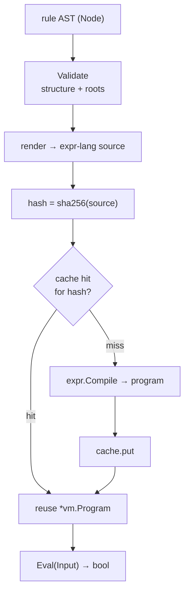

# Rules engine

A [grant](../getting-started/concepts.md#grant) can be gated on the *attributes*
of a request — deny a `read` unless the object's classification is `public`,
allow a `share` only for principals above a clearance tier. Aperture expresses
those conditions as **rules**. A rule is a small, typed **AST** that Aperture
compiles once to an expression program and evaluates in-process against the
object's metadata plus the principal/action context.

> **Aperture evaluates rules with [`expr-lang/expr`](https://github.com/expr-lang/expr)
> directly.** It renders each rule AST to an expr-lang expression and compiles it
> with expr-lang's pure-Go evaluator, in-process. There is **no external policy
> service and no dependency on Pulse** — any documentation that says "Pulse
> expression" is stale. The rules package imports `github.com/expr-lang/expr`;
> that is the whole engine.

The code lives in the `rules` package, in three layers: the AST (`ast.go`), the
compiler and cache (`compiler.go`, `cache.go`), and the engine (`engine.go`).

## The rule AST

A rule is a tree of `rules.Node` values. The node set is **deliberately small
and closed** so a node editor can map its palette one-to-one onto it, and so the
JSON form is a stable contract that round-trips byte-identically
(marshal → unmarshal → marshal). There is no second rule format.

| `NodeType` | Fields used | Meaning |
|---|---|---|
| `and` | `Children` (≥ 2) | logical conjunction |
| `or` | `Children` (≥ 2) | logical disjunction |
| `not` | `Children` (exactly 1) | logical negation |
| `compare` | `Op`, `Left`, `Right` | binary comparison |
| `var` | `Name` (dotted path) | a context-variable reference |
| `literal` | `Value` (scalar JSON) | a string, number, bool, or null constant |
| `list` | `Items` | an ordered list, the right side of `in`/`nin` |
| `call` | `Name`, `Items` (args) | a call to a registered pure function |

The comparison operators carried in `compare.Op` are `eq ne lt le gt ge in nin`,
rendered to `== != < <= > >= in "not in"` respectively.

Constructor helpers build the tree in Go — `And`, `Or`, `Not`, `Compare`, `Var`,
`Lit`, `List`, `Call`. This rule says *the object is public, or the principal's
tier is one of gold/platinum*:

```go
ast := rules.Or(
    rules.Compare(rules.OpEq, rules.Var("object.classification"), rules.Lit("public")),
    rules.Compare(rules.OpIn, rules.Var("principal.tier"),
        rules.List(rules.Lit("gold"), rules.Lit("platinum"))),
)
```

Its canonical JSON — the shape the editor and the state file persist — omits
every zero field, keeping the serialized form minimal:

```json
{
  "type": "or",
  "children": [
    {"type": "compare", "op": "eq",
     "left": {"type": "var", "name": "object.classification"},
     "right": {"type": "literal", "value": "public"}},
    {"type": "compare", "op": "in",
     "left": {"type": "var", "name": "principal.tier"},
     "right": {"type": "list", "items": [
       {"type": "literal", "value": "gold"},
       {"type": "literal", "value": "platinum"}]}}
  ]
}
```

### The evaluation context

A rule reads from a **closed set of four roots**, and only those — a reference to
anything else is an unknown variable:

| Root | Type | Contents |
|---|---|---|
| `object` | map | the object's metadata snapshot (host-defined fields, e.g. `object.classification`) |
| `principal` | map | the principal's attribute bag (e.g. `principal.tier`); default exposes only `principal.id` |
| `account` | map | account attributes |
| `action` | string | the action verb (`action == "read"`) |

The three metadata roots are `map[string]any` so a rule reads host-defined
fields dynamically; `action` is a typed string so misusing it (`action.foo`) is
a type error. This closed environment is enforced twice — structurally by
`Validate` (below) and again by the expr-lang type-checker at compile time.

## Validation

`Node.Validate()` checks that a node and its subtree are **structurally
well-formed** — the closed node set, the correct arities (`and`/`or` need ≥ 2
children, `not` exactly 1, `compare` a left and right operand), a known
comparison operator, a scalar literal, and a variable whose first path segment
is one of the four roots. It returns `APERTURE_RULE_INVALID` for a malformed node
and `APERTURE_RULE_UNKNOWN_VARIABLE` for a variable outside the exposed roots.

Validation is **pure structure** — it does not type-check and never touches the
expression engine. A literal is checked to carry a scalar (arrays and objects are
rejected; use a `list` node for collections). An `in`/`nin` right operand must be
a `list` or a `var`.

For the *deep* check — structure **plus** a full compile pass that surfaces type
errors and unknown functions — call `rules.ValidateAST(raw)`. It decodes a JSON
AST and compiles it against a shared package-level validator (nil source, nil
fetcher — it resolves no references and fetches no metadata), returning nil for a
compilable rule and an `APERTURE_RULE_*` code otherwise. This is what a
save/validate surface runs before persisting a rule.

## Compilation and caching

`Node.Expr()` renders the validated AST to an expr-lang expression string. The
rendering is direct and injection-free (variable paths are Go-style identifiers,
string literals are quoted, integers keep their exact form via `json.Number`):

```text
((object.classification == "public") || (principal.tier in ["gold", "platinum"]))
```

`Compiler.Compile(node)` validates, renders, and compiles that expression to a
reusable `*vm.Program` via `expr.Compile`. Every compiler fixes the same options:

- **`expr.Env(evalEnv{})`** — the typed four-root environment, so any other
  top-level identifier is an unknown name at compile time.
- **`expr.AsBool()`** — a rule must evaluate to a boolean.
- **`expr.DisableAllBuiltins()`** — all of expr-lang's builtins are off, so **no
  wall-clock or random function is reachable** and evaluation stays deterministic.
- **The curated pure function set** — `lower`, `upper`, `contains`, `startsWith`,
  `endsWith`, `len`. A host adds its own deterministic, side-effect-free functions
  with `rules.Function(name, fn)` / `Engine WithFunction`; these join (and can
  shadow) the curated set. An unknown function is caught at compile time.

A compile failure that survives validation is a type mismatch, a non-boolean
result, or a call to an unregistered function — all surfaced as
`APERTURE_RULE_TYPE_ERROR`, with the evaluator's own message preserved in context.
A `Compiled` is immutable and safe for concurrent evaluation; it carries the
canonical `Source()` and its `Hash()` (sha256 of the source).

### The compiled-rule cache

Compiling an expression is the expensive step, and `Check` runs on a tight
latency budget, so a compile happens **once per canonical form**. The engine keys
a `compiledCache` by the rule's canonical hash. Two different rule references
whose ASTs render to the *same* expression share a single compiled program.



The cache is concurrency-safe and exposes `Hits / Misses / Evictions / Entries`
via `Engine.CacheStats()`. An optional TTL (`WithCacheTTL`, with an injectable
`Clock` for deterministic tests) bounds entry lifetime; TTL ≤ 0 keeps entries
until explicit invalidation. When a rule's definition changes underneath a cached
compilation, a host calls `Engine.Invalidate(node)` (drop one) or
`Engine.InvalidateAll()` (clear).

## Evaluation and the engine

`Compiled.Eval(ctx, Input)` runs the program against an `Input` — `Object`,
`Principal`, and `Account` maps plus the `Action` string (a nil map reads as
empty). Evaluation is **pure**: it reads only the input, mutates nothing (the
object metadata snapshot is treated read-only), and exposes no nondeterministic
function. A runtime failure or a non-boolean result is `APERTURE_RULE_EVAL`.

`rules.Engine` ties the pieces together. It is built over a `RuleSource` (which
resolves an opaque rule reference to its `Rule` definition — `MapSource` is the
in-memory default; a missing reference yields `APERTURE_RULE_NOT_FOUND`) and a
`MetadataFetcher` (whose signature matches `*provider.Registry.Fetch`, so a
[provider registry](providers.md) wires in directly as the object-metadata
source without the rules package importing `provider`). An optional
`PrincipalResolver` supplies principal attributes; the default exposes only
`principal.id`.

`Engine.Selected(ctx, rule, object, principal, action)` is the full path:

1. resolve the rule reference through the `RuleSource`;
2. compile-and-cache its AST;
3. fetch the object's metadata (empty when no fetcher is configured);
4. resolve the principal's attributes;
5. build the `Input` and evaluate.

Any step's failure is an `APERTURE_*` coded error, and the caller treats it as a
**non-decision** — there is no select-on-error. That signature is exactly
`scope.RuleEvaluator`, which is how the rule-backed inclusive/exclusive
[scope strategies](scopes.md) get their variant: the engine is wired as
`scope.Deps{Rules: engine}`.

## Where this leads

Rules are one of two ways a scope strategy can decide object membership; the
other is an explicit id-list. See [scopes & scope strategies](scopes.md) for how
the inclusive and exclusive strategies consult a rule. The `object.*` fields a
rule reads come from [providers](providers.md).
