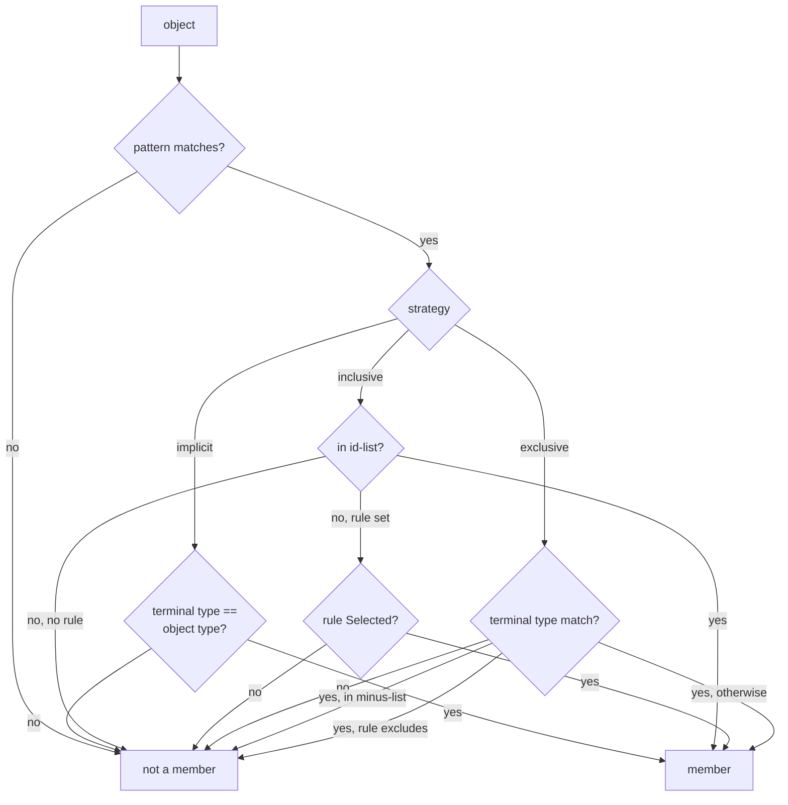

# Scopes & scope strategies

A grant's [pattern](identity.md) bounds *which* objects the grant can reach. But
"reach" is not always "every match" — a grant might cover **every** object of a
type in that scope, or **only** a named id-list, or **everything except** a few,
or whatever a [rule](rules.md) selects. That choice is the grant's **scope
strategy**, and this chapter covers the pluggable resolvers that implement it.
The code lives in the `scope` package.

The key separation: **the pattern bounds the scope and supplies the specificity
the engine's deny-overrides tiebreak consumes; the strategy decides membership
*within* that bound.** A resolver never computes specificity — that stays the
pattern's job in the engine, so the resolution semantics from literal-only grants
are untouched.

## The four strategies

| Strategy | Membership within the pattern scope |
|---|---|
| `literal` | exactly the objects the pattern matches (the baseline) |
| `implicit` | every object of the permission's type in scope — unfettered |
| `inclusive` | **opt-in**: only an explicit id-list, or objects a rule selects |
| `exclusive` | **opt-out**: all-of-type in scope **except** an id-list, or objects a rule excludes |

`literal` is owned natively by the decision engine and is **not** in the
registry. The `scope` package ships the other three plus a registry for host-defined
strategies. Membership always composes with the pattern: a listed object that
falls *outside* the grant pattern is not covered.

## The scope reference and `Spec`

A permission carries its strategy as an opaque string reference; the engine parses
it into a typed `scope.Spec` with `ParseSpec`. The grammar is a strategy key
optionally followed by `;`-separated `name=value` params. Identity strings never
contain `;`, `=`, or `,`, so those separators never collide with id-list values:

```text
implicit
inclusive;ids=account:acme/document:42,account:acme/document:99
exclusive;ids=account:acme/document:7
inclusive;rule=quarantine-rule
```

`ParseSpec` yields `Spec{Strategy, IDs, Rule}`. An empty reference (or the
explicit `literal`) parses to the literal strategy, so grants that carry no
strategy keep their literal behaviour. Parsing validates **structure only** —
known params (`ids`, `rule`), non-empty values, no duplicates — and does *not*
consult the registry, so a custom strategy key parses cleanly and is resolved by
whatever the host registered. Anything malformed is `APERTURE_SCOPE_INVALID`.

## The resolver contract

Each strategy is a `ScopeResolver`, constructed per evaluation from a
`GrantContext` (the already-parsed pattern, the permission's object type, the
parsed `Spec`, and the principal/action context) plus runtime `Deps`:

```go
type ScopeResolver interface {
    // hot path — "is this concrete object a member?" — never enumerates.
    Contains(ctx context.Context, object identity.Identity) (bool, error)
    // bounded enumeration for Enumerate-style callers.
    Members(ctx context.Context, pattern identity.Pattern) ([]identity.Identity, error)
}
```

`Contains` answers the `Check` hot-path question and never needs to list objects.
`Members` performs a **bounded** enumeration (capped by `DefaultMaxMembers` =
1000) for `Enumerate`-style callers. Resolver construction is cheap — small value
structs, id-list membership by linear scan, no per-evaluation map allocation — and
holds no cache.

### Two seam dependencies

Strategies that need to enumerate "all objects of a type", or evaluate a rule,
reach two seams through `scope.Deps`. Both default to an **inert** implementation
so a zero `Deps` is usable:

| Seam | Supplied by | Default behaviour |
|---|---|---|
| `ObjectLister` | the [provider Registry](providers.md) (`*Registry` matches its signature byte-for-byte) | `APERTURE_SCOPE_LISTER_UNCONFIGURED` |
| `RuleEvaluator` | the [rules Engine](rules.md) (`*rules.Engine` satisfies it) | `APERTURE_SCOPE_RULE_UNCONFIGURED` |

`RuleEvaluator.Selected(ctx, rule, object, principal, action)` is exactly
`rules.Engine.Selected` — that shared signature is how the rule-backed path is
wired without `scope` importing `rules`.

## How each strategy decides `Contains`



**implicit** — membership is the conjunction of the pattern match and a
*terminal-type* check (the object's last segment is of the permission's object
type). It takes no configuration; supplying an `ids` list or a `rule` is a
misconfiguration and is rejected so it cannot silently mask intent. `Members`
must list the type, so it depends on the `ObjectLister`.

**inclusive** — an opt-in. It must declare an id-list *or* a rule; neither is a
misconfiguration. `Contains` first requires the pattern match, then: the object's
canonical id is in the list (exact string equality), or — only when a rule is
declared — the `RuleEvaluator` selects it. A pure list-backed grant never touches
the rule dependency. `Members` on the list path needs no lister (the members are
the listed ids within both patterns); a rule-only inclusive grant cannot
enumerate without the evaluator's reverse index and reports
`APERTURE_SCOPE_RULE_UNCONFIGURED`.

**exclusive** — an opt-out. It requires a minus id-list or a rule (declaring
neither would make it identical to implicit). `Contains` requires the pattern
match and the terminal-type check, then is a member **unless** the object is in
the minus-list or the rule excludes it. `Members` enumerates all-of-type in scope
via the `ObjectLister` and drops the excluded ones through `Contains`.

## The registry

`scope.Registry` maps strategy keys to `Factory` functions. `DefaultRegistry()`
preloads the three built-ins (`implicit`, `inclusive`, `exclusive`); `literal`
stays native to the engine and is intentionally absent. A host adds its own with
`Register` / `MustRegister` (rejecting an empty key, a nil factory, or a
duplicate with `APERTURE_SCOPE_INVALID`).

`Registry.Resolve(grantContext, deps)` builds the resolver for the spec's
strategy, validating the spec via the strategy's factory. An unregistered
strategy yields `APERTURE_SCOPE_UNKNOWN_STRATEGY`; a spec the strategy rejects
yields `APERTURE_SCOPE_INVALID`.

```go
reg := scope.DefaultRegistry()

spec, _ := scope.ParseSpec("exclusive;ids=account:acme/document:7")
gc := scope.GrantContext{
    Pattern:    identity.MustParsePattern("account:acme/document:*"),
    ObjectType: "document",
    Spec:       spec,
    Principal:  "user:alice",
    Action:     "read",
}
resolver, _ := reg.Resolve(gc, scope.Deps{Lister: providerReg /* , Rules: rulesEngine */})
ok, _ := resolver.Contains(ctx, identity.MustParse("account:acme/document:42"))
// true: matches the pattern, is a document, and is not in the minus-list.
```

## Where this leads

The `ObjectLister` that implicit and exclusive enumeration depend on is the
[provider Registry](providers.md); the `RuleEvaluator` the rule-backed paths
consult is the [rules Engine](rules.md). For how the decision engine assembles
grants, resolvers, and specificity into a verdict, see the
[library Decision API](../library/decision-api.md).
