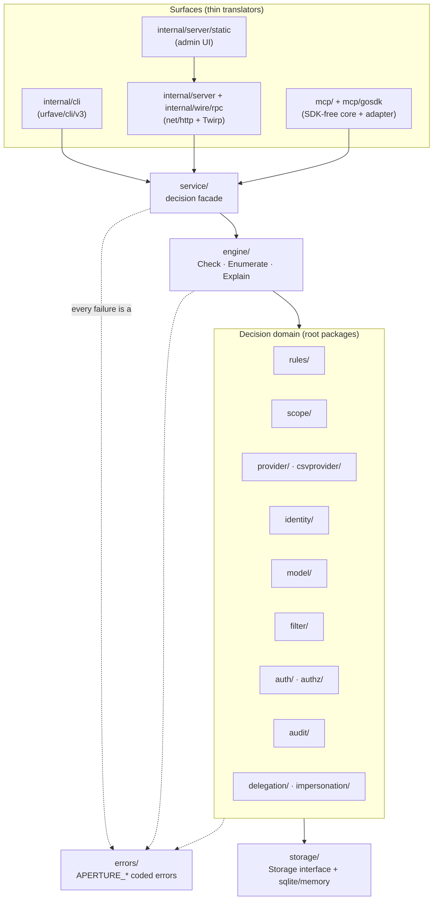

# Architecture

**Audience:** contributors and integrators who want to understand how Aperture is
put together before extending it.

Aperture is a **policy decision point (PDP)**: a single engine that answers *"is
this principal allowed to do this thing to this resource, and why?"* This page
sketches the shape of the codebase and the one tenet that governs it. The
authoritative statement of the project's conventions is
[`CLAUDE.md`](https://github.com/frankbardon/aperture/blob/main/CLAUDE.md) at the
module root — when this page and `CLAUDE.md` disagree, `CLAUDE.md` wins. This
page stays deliberately thin so it does not drift from that source of truth.

## The one tenet: surfaces are thin translators

There is exactly one place a decision is made. Everything a caller can touch —
the `aperture` CLI, the Twirp/HTTP RPC API, the MCP server, and the admin UI — is
a **thin translator** over one decision engine. A surface's only job is to turn
its wire format into a decision request, hand it to the engine, and render the
result back out. No surface re-implements policy logic.

The payoff is consistency: the answer a shell script gets from the CLI is the
same answer a service gets over RPC and an agent gets over MCP, because all three
ride the same `Check` / `Enumerate` / `Explain` path.

## Library-first

The product is the **public Go packages at the module root**
(`github.com/frankbardon/aperture`) — not the binary. `cmd/aperture/main.go` is a
tiny adapter that calls `internal/cli.NewApp`; it holds no business logic. This
is the "library-first" rule: business logic lives in the root packages, and the
`serve` command wires them together with manual dependency injection (no
`wire`/`fx`/`dig`).

## Package boundaries

Read the arrows as "depends on / calls into". The `errors/` package underpins
every layer: every failure that crosses a package boundary is an `APERTURE_*`
coded error (see [Error taxonomy](../concepts/errors.md)). The dependency graph
points **downward** — `scope`, `provider`, `identity`, and `model` are leaves
that the engine adapts to, never the other way round.

## The decision API

The engine exposes three operations, each in a single and a bulk-batched form:

| Operation | Question it answers |
|---|---|
| **Check** | May this principal perform this action on this resource? |
| **Enumerate** | Which resources/actions is this principal allowed? |
| **Explain** | *Why* was a decision reached — which rules and grants applied? |

`Explain` is first-class, not a debugging afterthought: decisions are auditable
by construction. The [Decision API](../library/decision-api.md) and
[Batch operations](../library/batch.md) chapters cover the library surface;
[The service facade](../library/service-facade.md) is the seam every surface
translates into.

## Constraints that shape the code

These are hard rules — a change that breaks one is a defect:

- **Pure-Go, `CGO_ENABLED=0` end to end.** No CGO packages (no geo/h3).
- **No dependency on Pulse.** The rules engine renders its AST to an
  [`expr-lang/expr`](https://github.com/expr-lang/expr) expression and compiles
  it in-process. See [Rules engine](../concepts/rules.md).
- **No ORM / sqlc / migration tool.** Storage is hand-written SQL over
  `modernc.org/sqlite` plus an in-memory implementation behind one `Storage`
  interface. See [Storage](../concepts/storage.md).
- **No bare errors across package boundaries.** Wrap in an `APERTURE_*` code.
- **No cross-account leakage** through error messages.

## Where to go next

- [Package layout](package-layout.md) — what each root package owns.
- [Extending Aperture](extending.md) — the "Adding a…" recipes.
- [The Update-Demand rule](update-demand.md) — the docs-with-code house rule.
